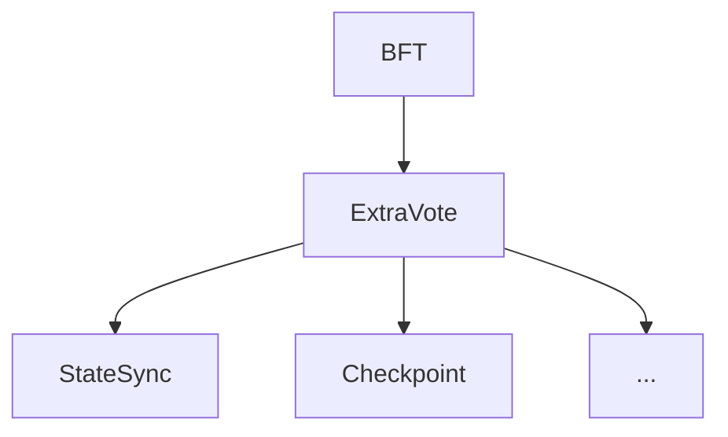

# 共识扩展

共识扩展为开发者提供了可自定义数据参与共识的机制。`ConsensusExtendModule`和`BlockCommitter`开发人员可以在其模块中实现。在底层共识引擎提议区块、验证区块、以及提交区块时触发。

## ConsensusExtendModule

在AppChain-SDK中`ExtraVote`模块实现了`CensensusExtendModule`接口，其他所有使用共识扩展机制的模块可实现`ExtraVote`模块的`ExtraVerifier`接口来达到相同的目的。AppChain-SDK系统模块`StateSync` `Checkpoint`就是通过实现`ExtraVerifier`接口来实现共识扩展的。



`ExtraVote`模块主要完成以下功能:

- 收集子模块的`extend data`
- 将子模块的`extend data`构造成一棵 Merkle 树，Merkle树的根作为`extend data hash`参与共识
- 保存Merkle树到本地数据库，为子模块提供获取/验证 Merkle树证明的接口

### ExtraVote

```go title="x/extravote/module.go"
func (e *ExtraVote) ExtendData(ctx sdk.ConsensusContext) []byte {
	data := make([][]byte, len(e.modules))
	for i, m := range e.modules {
		data[i] = m.ExtendData(ctx)
		log.Info("Extend data for module", "module", m.Name(), "data", len(data[i]))
	}
	extraData, _ := rlp.EncodeToBytes(data)
	return extraData
}

func (e *ExtraVote) VerifyExtendData(ctx sdk.ConsensusContext, data []byte) (common.Hash, error) {
	cc := ctx.(sdk.ConsensusContext)

	var extraData [][]byte
	err := rlp.DecodeBytes(data, &extraData)
	if err != nil {
		return common.Hash{}, err
	}
	if len(extraData) != len(e.modules) {
		return common.Hash{}, errors.New("invalid extra data length")
	}
	for i, m := range e.modules {
		err := m.VerifyExtendData(ctx, extraData[i])
		if err != nil {
			log.Error("Failed to verify extend data", "i", i, "module", m.Name(), "err", err)
			return common.Hash{}, err
		}
	}
	trie, err := merkle.NewMerkleTree(extraData)
	if err != nil {
		return common.Hash{}, err
	}
	e.db.InsertProof(cc.Epoch(), cc.View(), cc.BlockIndex(), extraData, trie)

	return trie.Hash(), nil
}

func (e *ExtraVote) PrepareQC(ctx sdk.ConsensusContext, block *protocols.PrepareBlock, votes map[uint32]*protocols.PrepareVote) {
	for _, m := range e.modules {
		m.PrepareQC(ctx, block, votes)
	}
}
```

### ExtraVerifier

#### Name

!!! info "name"

    `Name() string`

    返回模块的名称。


```go title="x/statesync/module.go"
func (s *StateSync) Name() string {
	return "statesync"
}
```

#### ExtendData

!!! info "ExtendData"
    `ExtendData(ctx sdk.ConsensusContext) []byte`

    参数：

    - **ctx** AppChain SDK consensus context.

    返回值：返回子模块的扩展数据。


```go title="x/statesync/module.go"
func (s *StateSync) ExtendData(ctx sdk.ConsensusContext) []byte {
	return s.ExtendDataImpl(ctx, ctx.Epoch(), ctx.View(), ctx.BlockIndex(), ctx.Header())
}
```

#### VerifyExtendData

!!! info "VerifyExtendData"

    `VerifyExtendData(ctx sdk.ConsensusContext, data []byte) error`

    参数：

    - **ctx** AppChain SDK consensus context.
    - **data** 子模块的扩展数据。

    返回值：

    - 成功返回`nil`。
    - 失败返回具体的错误。

```go title="x/statesync/module.go"
func (s *StateSync) VerifyExtendData(ctx sdk.ConsensusContext, data []byte) error {
	return s.VerifyExtendDataImpl(ctx.Epoch(), ctx.View(), ctx.BlockIndex(), ctx.Header(), data)
}
```

#### PrepareQC

!!! info "PrepareQC"

    `PrepareQC(ctx sdk.ConsensusContext, block *protocols.PrepareBlock, votes map[uint32]*protocols.PrepareVotes)`

    参数：

    - **ctx** AppChain SDK consensus context.
    - **block** 子模块共识数据对应的区块。
    - **votes** 验证人对共识数据的投票。

```go title="x/statesync/module.go"
func (s *StateSync) PrepareQC(ctx sdk.ConsensusContext, block *protocols.PrepareBlock, votes map[uint32]*protocols.PrepareVote) {
	s.PrepareQCImpl(block, votes)
}
```

## BlockCommitter

`BlockCommitter`接口底层共识引擎在区块提交时触发。

!!! info "OnCommit"

    `OnCommit(ctx sdk.ConsensusContext, block *types.Block) error`

    参数：

    - **ctx** AppChain SDK consensus context.
    - **block** 提交的区块。

    返回值：

    - 成功返回`nil`。
    - 失败返回具体错误。

```go title="x/checkpoint/module.go"
func (m *Module) OnCommit(ctx sdk.ConsensusContext, block *coretypes.Block) error {
	logger := m.logger.New("epoch", ctx.Epoch(), "view", ctx.View(), "index", ctx.BlockIndex(), "number", ctx.Header().Number, "hash", ctx.Header().Hash())
	blockNumber := block.NumberU64()
	isEndOfRound := m.staking.IsEndOfRound(ctx, blockNumber)

	logger.Info("OnCommit", "isEndOfRound", isEndOfRound, "isProposer", ctx.IsProposer())

	if ctx.View() > 0 && ctx.BlockIndex() == 0 &&  ctx.IsProposer() {
		// Try to submit old checkpoint to rootchain.
		go func(number uint64) {
			if err := m.submitCheckpoint(ctx, number, nil); err != nil {
				logger.Error("Failed to submit checkpoint", "err", err)
			}
		}(blockNumber)
	}

	if isEndOfRound {
		_, qc, err := ctypes.DecodeExtra(block.ExtraData())
		if err != nil {
			logger.Error("Failed to decode block extra data", "err", err)
			return err
		}

		if ctx.IsProposer() {
			go func(number uint64) {
				if err := m.submitCheckpoint(ctx, number, qc); err != nil {
					logger.Error("Failed to submit checkpoint", "err", err)
				}
			}(blockNumber)
		}
	}
	return nil
}
```
