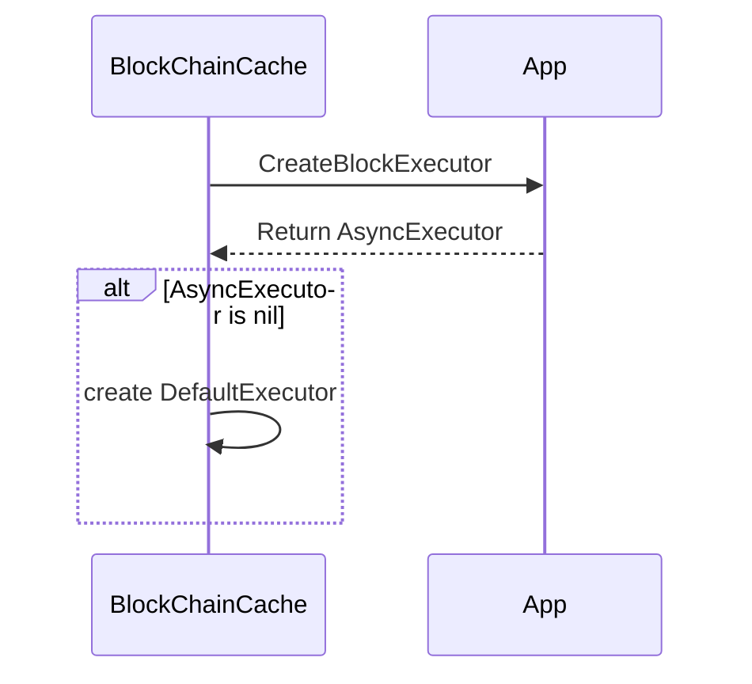
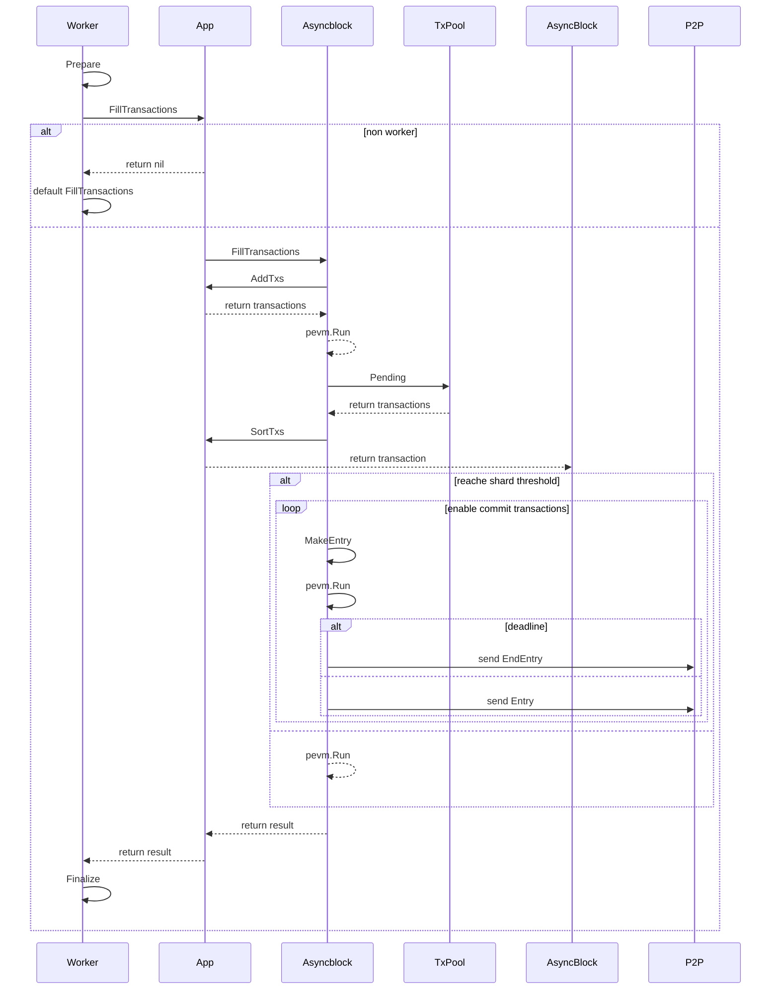
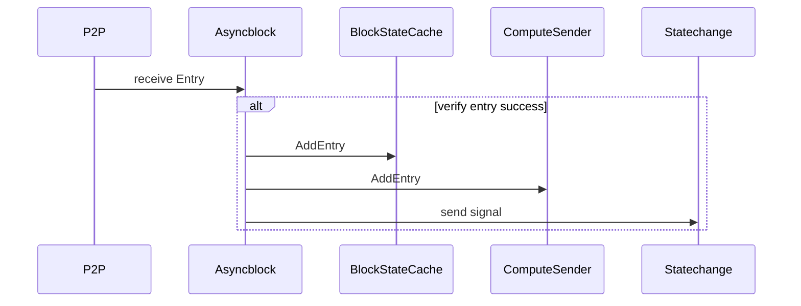
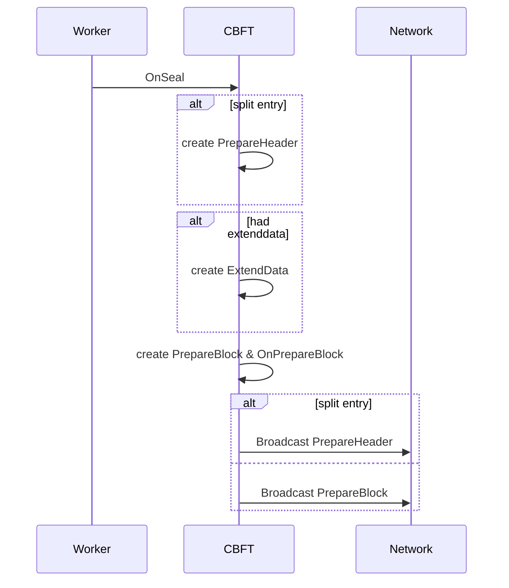
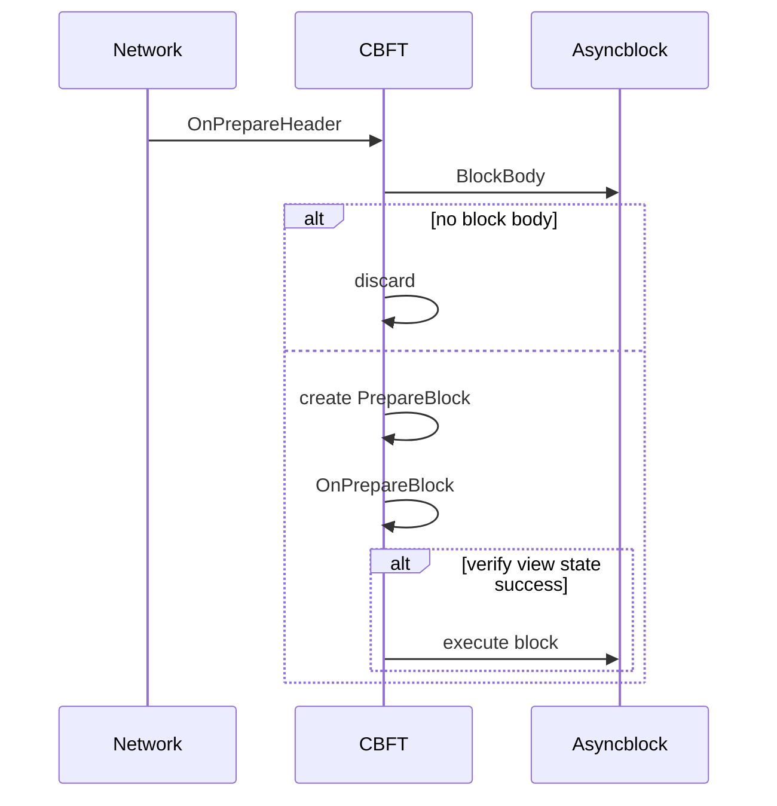
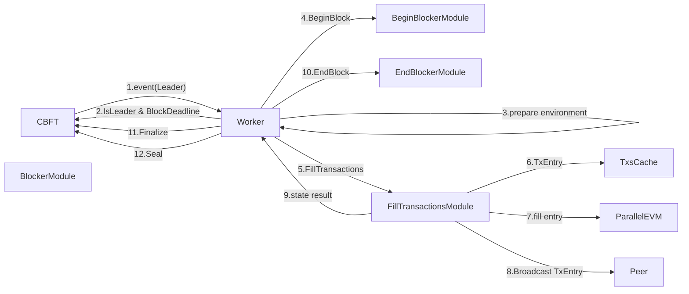

# Asyncblock

现有的出块流程是在区块在本地执行完成后交由共识协议将区块发给其它验证节点，Asyncblock方案，区块的执行异步化，即将提议的区块内的交易，Leader 与其它 Validator 同时执行，减少共识时间，增加区块执行时间。执行交易与区块投票进行完全异步化。 现有的时间计算

```
区块确认时间 = 区块执行时间+2*RTT
区块可打包交易时间 = (区块时间间隔 - RTT)/2
```

```
               ┌─────────┐    ┌─────────┐    ┌───────────┐      ┌─────────┐    ┌─────────┐    ┌───────────┐                 
               │         │    │         │    │           │      │         │    │         │    │           │                 
leader         │ entry.1 │    │ entry.2 │    │ entry.end │      │ entry.1 │    │ entry.2 │    │ entry.end │                 
               │         │    │         │    │           │      │         │    │         │    │           │                 
               └─────────┘    └─────────┘    └───────────┘      └─────────┘    └─────────┘    └───────────┘                 
                RTT                                              RTT                                                        
               │───├─────────┐    ┌─────────┐    ┌───────────┐  │───├─────────┐    ┌─────────┐    ┌───────────┐             
                   │         │    │         │    │           │      │         │    │         │    │           │             
validator          │ entry.1 │    │ entry.2 │    │ entry.end │      │ entry.1 │    │ entry.2 │    │ entry.end │             
                   │         │    │         │    │           │      │         │    │         │    │           │             
                   └─────────┘    └─────────┘    └───────────┘      └─────────┘    └─────────┘    └───────────┘             
                                                                                                                            
                                                         ┌─────────────┐                   ┌─────────┐                      
                                                         │             │                   │         │                      
leader                                                   │PrepareHeader┼                   │PrepareQC┼                      
                                                         │             │                   │         │                      
                                                         └─────────────┘                   └─────────┘                      
                                                                        RTT             RTT           RTT                   
                                                                       │───│           │───│         │───│                  
                                                                           ├───────────┤                 ┌─────────┐        
                                                                           │           │                 │         │        
validator                                                                  │PrepareVote┼                 │Finalize ┼        
                                                                           │           │                 │         │        
                                                                           └───────────┘                 └─────────┘        
                                                                                                                     
```

新的异步化后，区块的执行时间

```
区块确认时间 = 最后一个Entry执行时间+3*RTT
区块可打包交易时间 = 区块时间间隔 - 最后一个Entry执行时间 - RTT
```

## 启动参数

* asyncblock.concurrency_level PEVM 虚拟机并行度
* asyncblock.force_sequential  PEVM 强制串行执行
* asyncblock.txs_batch PEVM 并行每批交易数量
* asyncblock.entrysize 每个交易分片最大交易数量
* asyncblock.splitthreshold 交易数量达到多少时对区块交易进行分片发送
* asyncblock.computersenderthread 计算交易 sender 并行协程数量

## Interface

为了适配异步区块的功能，需要实现扩展接口

* `FillTransactionsModule` 对出块交易进行分片分发。
* `BlockExecutorModule` 异步执行器，执行分片交易，将StateDB 、Receipts给到`Appchain-Base`的 BlockchainCache 模块
* `TxExecutorModule` 适配RPC调用来执行交易
* `P2PModule` P2P模块用于发送给验证人分片
* `ViewChangeModule` 切换View 时更新 P2P 验证节点信息；清理过期StateDB、Receipts
* `BlockCommitterModule` 清理过期分片

## BlockChainCache 初始化



目前的 CBFT 执行区块会调用到 BlockChainCache 来执行区块，BlockChainCache 会缓存执行后的 statedb 与 receipts。现在要调整将执行分为两部分
* DefaultExecutor 对应现有的执行
* AsyncExecutor 通过调用 CreateBlockExecutor 接口来创建 SDK 层面执行器

## Leader 生产区块



* Worker 会准备 header, statedb 相关信息
* 调用 WorkerApp 的 FillTransactions 调用到 SDK 层面 Module 来执行交易
* 如果没有实现 FillTransactions，则调用现有默认的 FillTransactions
* Asyncblock 首先获取其它模块的系统交易进行执行
* Asyncblock 再从交易池获取交易、排序
* Asyncblock 对交易进行分片，执行后发送，如果是最后一个分片则标记end标志(这里受到asyncblock.entrysize、asyncblock.splitthreshold限制)
* 再调用 Worker 的 Finalize 给到共识进行提议

## Validator 接收分片



* 接收到 entry 验证 entry 签名是当前 leader 或者下一任 leader 发送的 entry
* entry 加入到缓存
* 计算entry内交易 sender
* 发送信号，通知分片执行器执行

## 提议区块



* Worker 会调用 OnSeal 到共识模块
* 创建提案信息 PrepareHeader
* 共识创建共识扩展相关提案
* 本地仍然缓存 PrepareBlock 并调用现有的 OnPrepareBlock 现有流程
* 广播出 PrepareHeader 消息吧

## PrepareHeader 验证



* 根据blockNumber、epoch、view找到body
* 根据body组装为PrepareBlock
* 调用OnPrepareBlock

## 出块流程



### CBFT 协议

增加新协议消息 PrepareHeader

```go
type PrepareHeader struct {
    Epoch         uint64               `json:"epoch"`
    ViewNumber    uint64               `json:"viewNumber"`
    Block         *types.Header         `json:"blockHeader"`
    BlockIndex    uint32               `json:"blockIndex"`             // The block number of the current ViewNumber proposal, 0....10
    ProposalIndex uint32               `json:"proposalIndex"`          // Proposer's index.
    PrepareQC     *ctypes.QuorumCert   `json:"prepareQC" rlp:"nil"`    // N-f aggregate signature
    ViewChangeQC  *ctypes.ViewChangeQC `json:"viewchangeQC" rlp:"nil"` // viewChange aggregate signature
    Signature     ctypes.Signature     `json:"signature"`              // PrepareBlock signature information
    ExtendData    []byte               `json:"extendData"`             // Extend data
    messageHash   atomic.Value         `rlp:"-"`
    extendHash    atomic.Value          `rlp:"-"`
}
```

修改 PrepareBlock 消息包的签名验证，由于改版后 Leader 通过发送 PrepareHeader 来发起提案，那么如何以前的流程节点请求 PrepareBlock 时，则无法验证，因为 Leader 没有签署相关消息。所以在对 PrepareBlock 的签名结构中将不对 body 进行签名，仅对 Header 进行签名，这样 PrepareHeader+BlockBody 组装即为 PrepareBlock。在验证签名时则需要根据 BlockHeader 的 transactionsRoot 验证 Body。

## P2P 协议

```go
type Entry struct {
	Epoch          uint64
	View           uint64
	BlockNumber    uint64
	ParentSealHash common.Hash //由于分片协议中父区块执行交易后并没有确认，没有得到ParentHash，使用seal hash 更适合分片场景
	Header         *types.Header `rlp:"nil"` //
	EntryNumber    uint32
	Transactions   []*types.Transaction
	Ending         uint8
	Signature      []byte
}
```

## 构建

```go
//加载参数
asyncblock.AddAsyncBlockFlags(cliApp)
//创建模块
asyncBlock := asyncblock.NewModule(ctx)
manger := module.NewManager(...,asyncBlock)
//设置
manager.SetOrderBlockCommitter(...,asyncBlock)
//设置初始化顺序
manager.SetOrderInit(...,asyncBlock)
//设置创世初始化顺序
manager.SetOrderGenesis(...,asyncBlock)
//设置FillTransaction
manager.SetTxFiller(asyncBlock.Name())
//设置ExecuteTxs
manager.SetTxExecutor(asyncBlock.Name())
//设置CreateBlockExecutor
manager.SetBlockExecutor(asyncBlock.Name())
```
