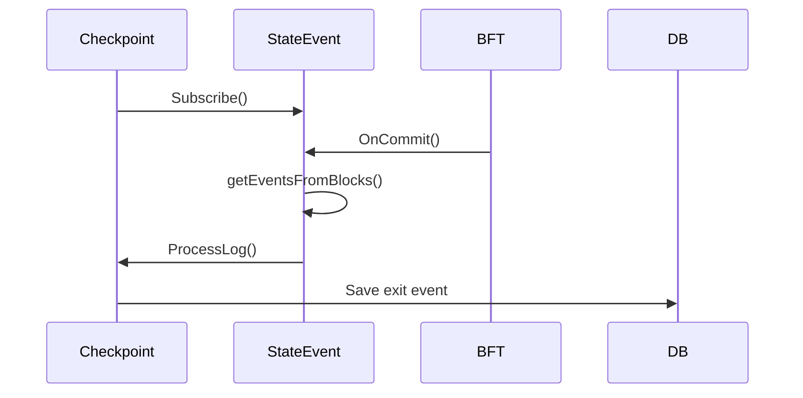
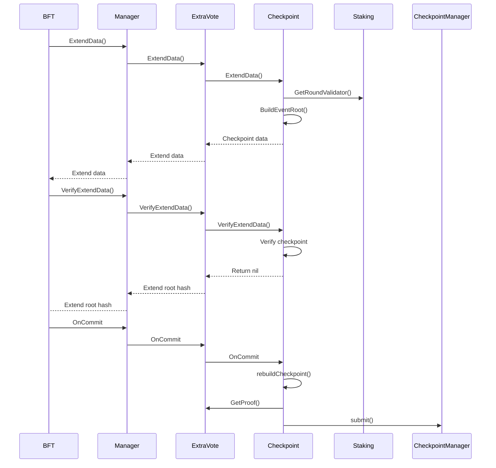

# Checkpoint

Checkpoint 是 SDK 的核心模块，负责定期将应用状态的快照提交到L1 CheckpointManager合约中。

## 实现

### ExtendData

在共识引擎的每一次调用`ExtendData()`方法中，checkpoint模块都会判断当前提议的区块是否是共识轮（每250个区块为一轮）最后一个区块。若是最后一个区块，则生成`CheckpointData`并作为扩展数据返回。

```go title="x/checkpoint/types/checkpoint_data.go"
type CheckpointData struct {
	ChainID uint64
	EpochNumber           uint64
	ViewNumber            uint64
	BlockIndex            uint32
	BlockNumber           uint64
	BlockHash             common.Hash
	CurrentValidatorsHash common.Hash
	NextValidatorsHash    common.Hash
	EventRoot             common.Hash
}
```

### VerifyExtendData

在`VerifyExtendData()`中，同样判断当前的区块是否是共识轮最后一个区块。若是最后一个区块，则解析`data`为`CheckpointData`，并验证`CheckpointData`所有的字段是否与本地节点生成的一致。

### OnCommit

共识引擎每提交一个区块，都会调用`OnCommit()`方法。在`OnCommit()`方法中提交checkpoint的目的是，确保checkpoint对应的区块为不可逆区块。

为了及时提交历史checkpoint以及减少访问`CheckpointManager`合约的次数，当前区块提议人（非共识轮第一个提议人）允许在第一个提议的区块不可逆时提交历史checkpoint。

提交checkpoint的条件：

1. Checkpoint对应的区块为不可逆区块。
2. 当前提交区块为共识轮最后一个区块。
2. 节点为当前区块提议人。

## 流程

### 订阅退出事件



### 提交checkpoint




## JSON-RPC

### checkpoint_generateExitProof

`checkpoint_generateExitProof`接口用于生成退出事件证明，用户使用该证明调用根链`ExitHelper`合约`exit()`或`batchExit()`方法执行退出事件，以完成应用链到根链的状态同步过程。

**参数**

QUANTITY - 退出事件ID

`params: [1]`

**返回值** Object - 退出事件证明

- Data: Array, 32 字节 - 退出事件的证明列表
- Metadata: Object - 退出事件证明
  - CheckpointBlock: QUANTITY - 此退出事件所在的checkpoint的区块块高
  - ExitEvent: DATA - 退出事件`L2StateSynced`的编码
  - LeafIndex: QUANTITY - 退出事件在Merkle树上的节点编号


**示例**
```shell
// Request
curl --location --request POST 'http://127.0.0.1:7792/' \
--header 'Content-Type: application/json' \
--header 'Accept: */*' \
--header 'Host: 127.0.0.1:7792' \
--header 'Connection: keep-alive' \
--data-raw '{
    "jsonrpc": "2.0",
    "method": "checkpoint_generateExitProof",
    "params": [1],
    "id": 0
}'

// Result
{
    "jsonrpc": "2.0",
    "id": 0,
    "result": {
        "Data": [
            "0xc5d2460186f7233c927e7db2dcc703c0e500b653ca82273b7bfad8045d85a470"
        ],
        "Metadata": {
            "CheckpointBlock": 1750,
            "ExitEvent": "0000000000000000000000000000000000000000000000000000000000000001000000000000000000000000100000000000000000000000000000000000000500000000000000000000000073ca1999dcbec47b7873100ea02f94fe1e07f924000000000000000000000000000000000000000000000000000000000000008000000000000000000000000000000000000000000000000000000000000000608ca9a95e41b5eece253c93f5b31eed1253aed6b145d8a6e14d913fdf8e7322930000000000000000000000002004d7ffc7c79f19d4275850e1015f2a4e2cb9090000000000000000000000000000000000000000000000000000000000000000",
            "LeafIndex": 1
        }
    }
}
```


## Flags

| 参数名                | 说明                               |
|-----------------------|------------------------------------|
| --checkpoint.keystore | keystore文件（用于提交checkpoint） |
| --checkpoint.password | keystore的密码                     |
