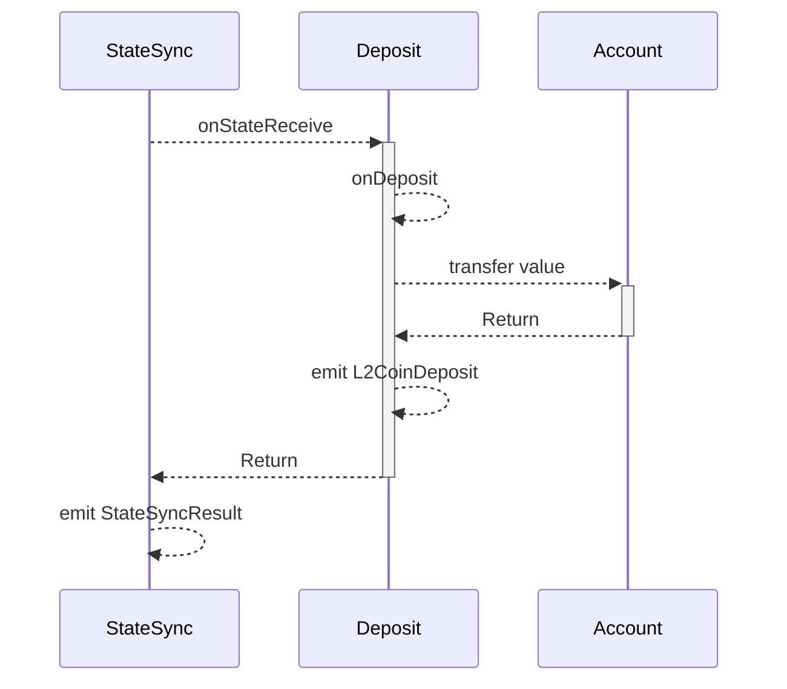
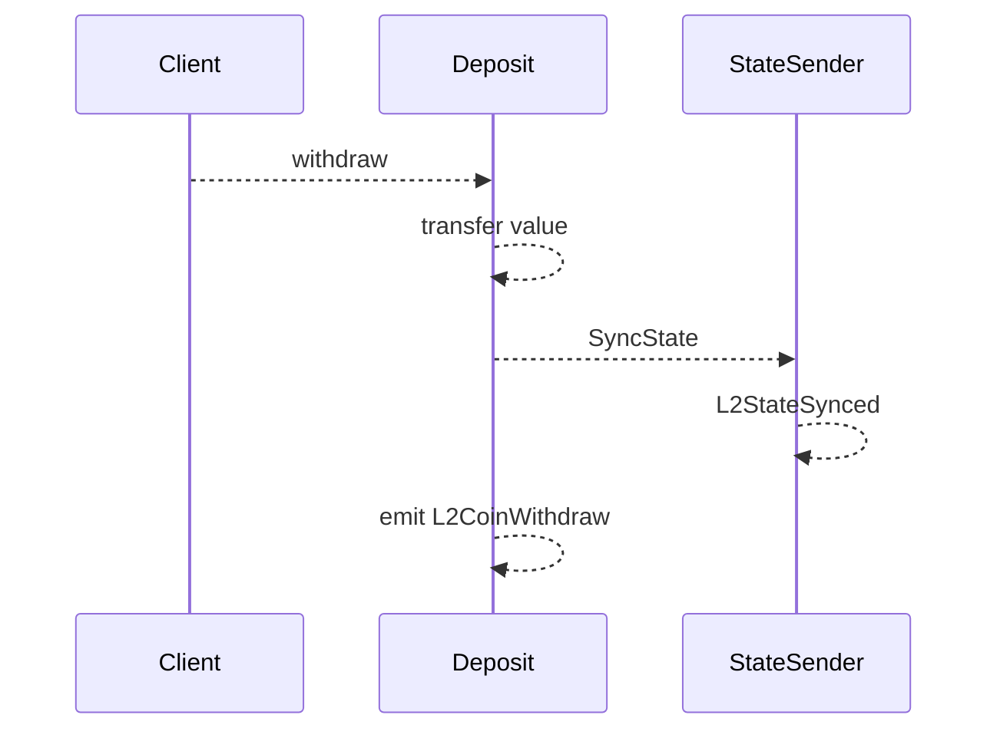

# Deposit

Deposit 实现 L1->L2 的代币质押，L2->L1 代币提取。Deposit 主要实现合约模块

## 合约

```solidity title="x/deposit/sol/IDepositHandler.sol"
interface IDepositHandler {
    event L2CoinDeposit(address indexed recipient, address depositor, uint256 amount);
    event L2CoinWithdraw(address indexed recipient, address withdrawer, uint256 amount);

    function onStateReceive(uint256, /* id */ address sender, bytes calldata data) external;
    function withdraw(address recipient, uint256 amount) external;
}
```

## 流程

* 质押



StateSync 模块执行 L1 事件，调用 Deposit 的 onStateReceive 事件，再调用 onDeposit 进行代币划转，触发 L2CoinDeposit 事件， StateSync 会触发 StateSyncResult 将执行结果作为事件。

* 提取
  


客户端调用 Deposit 模块的 withdraw 函数， 调用 StateSender 触发 L2->L1 的 L2StateSynced 事件，最后触发 Deposit 自身 L2CoinWithdraw 事件 