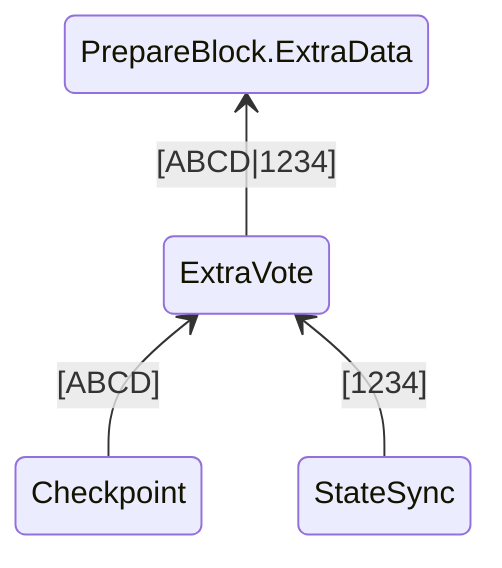
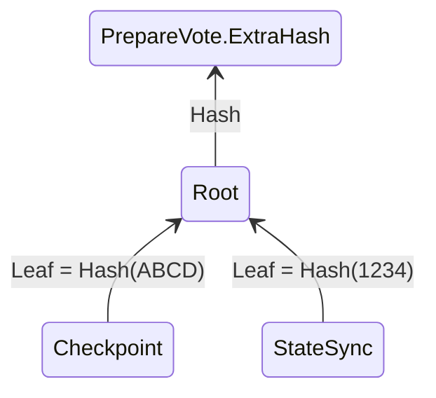

# ExtraVote

ExtraVote 实现了 Giskard-BFT 共识扩展，便于各个子模块实现共识模块扩展。应用 ExtraVote 模块前需要了解 ExtraVote 对于扩展的实现架构

* ExtraData

提案阶段 PrepareBlock中的 ExtraData 由 ExtraVote 收集各个子模块的 ExtraData，利用 RLP 编码字节流



* ExtraData

投票阶段 PrepareVote 中的 ExtraHash 由 ExtraVote 通过各个子模块的 ExtraData 构成 Merkle 树的 Root 作为 ExtraHash



## 实现

ExtraVote 模块实现了 以下接口:


```go
type ConsensusExtendModule interface {
	Module
	ExtendData(ctx sdk.ConsensusContext) []byte
	VerifyExtendData(ctx sdk.ConsensusContext, data []byte) (common.Hash, error)
	PrepareQC(ctx sdk.ConsensusContext, block *protocols.PrepareBlock, votes map[uint32]*protocols.PrepareVote)
}
```

* ExtendData 实现

```go title="x/extravote/module.go"
func (e *ExtraVote) ExtendData(ctx sdk.ConsensusContext) []byte {
    data := make([][]byte, len(e.modules))
	//调用获取各个子模块的 ExtendData
    for i, m := range e.modules {
        data[i] = m.ExtendData(ctx)
        log.Info("Extend data for module", "module", m.Name(), "data", len(data[i]))
    }
	//RLP 编码，编译为字节流数组
    extraData, _ := rlp.EncodeToBytes(data)
    return extraData
}
```

* VerifyExtendData 实现

```go title="x/extravote/module.go"
func (e *ExtraVote) VerifyExtendData(ctx sdk.ConsensusContext, data []byte) (common.Hash, error) {
	cc := ctx.(sdk.ConsensusContext)
    //解码data
	var extraData [][]byte
	err := rlp.DecodeBytes(data, &extraData)
	if err != nil {
		return common.Hash{}, err
	}
	if len(extraData) != len(e.modules) {
		return common.Hash{}, errors.New("invalid extra data length")
	}
	//将各个子模块的 ExtraData 进行校验
	for i, m := range e.modules {
		err := m.VerifyExtendData(ctx, extraData[i])
		if err != nil {
			log.Error("Failed to verify extend data", "i", i, "module", m.Name(), "err", err)
			return common.Hash{}, err
		}
	}
	// 生成 Merkle 树
	trie, err := merkle.NewMerkleTree(extraData)
	if err != nil {
		return common.Hash{}, err
	}
	// 写入DB，每个Merkle 与 共识的 Epoch、View，BlockIndex 进行关联
	e.db.InsertProof(cc.Epoch(), cc.View(), cc.BlockIndex(), extraData, trie)

	return trie.Hash(), nil
}
```

* DB

```go title="x/extravote/db.go"
// Store名称，也是存储的前缀 
const ExtraVoteDatabase = "extravote"
func NewExtraVoteDB(store store.Store) *ExtraVoteDB {
	db := store.GetKVStore(ExtraVoteDatabase)
	return &ExtraVoteDB{
		db: db,
	}
}

func (db *ExtraVoteDB) InsertProof(epoch, view uint64, index uint32, leaves [][]byte, tree *merkle.MerkleTree) error {
	// 遍历 叶子节点
	for _, leaf := range leaves {
		// 查询叶子节点证明
		proof, err := tree.GenerateProof(leaf)
		if err != nil {
			return err
		}
		// 获取 叶子节点在树中的 index
		leafIndex, err := tree.LeafIndex(leaf)
		if err != nil {
			return err
		}
        // 编码 证明
		raw, err := rlp.EncodeToBytes(&ExtraDataProof{
			Index: leafIndex,
			Proof: proof,
		})
		if err != nil {
			return err
		}
		// 写入DB key=epoch+view+index+leaf
		db.db.Set(encodeEpochViewHash(epoch, view, index, leaf), raw)
	}
	return nil
}

func (db *ExtraVoteDB) GetProof(epoch, view uint64, index uint32, leaf []byte) (uint64, []common.Hash, error) {
	// 获取证明字节流
	raw, err := db.db.Get(encodeEpochViewHash(epoch, view, index, leaf))
	if err != nil {
		return 0, nil, err
	}
	//解码
	var extraProof ExtraDataProof
	err = rlp.DecodeBytes(raw, &extraProof)
	if err != nil {
		return 0, nil, err
	}
	return extraProof.Index, extraProof.Proof, nil
}
```

## 使用

将会在[CheckPoint](../../build/x/checkpoint.md)及[StateSync](../../build/x/statesync.md)中介绍如何利用 ExtraVote 实现扩展