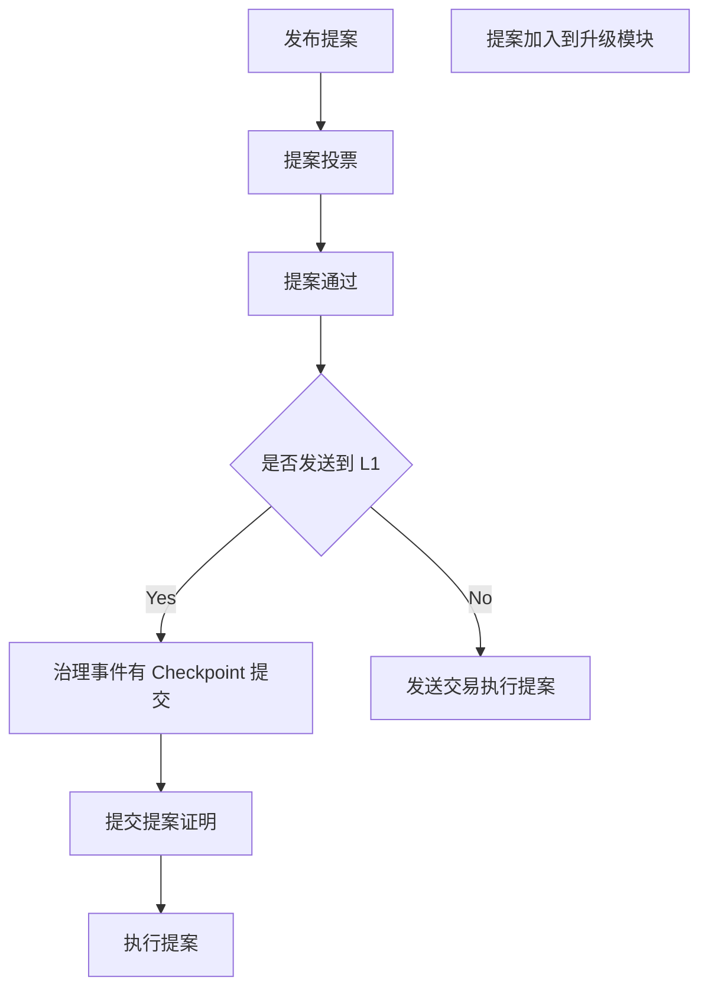
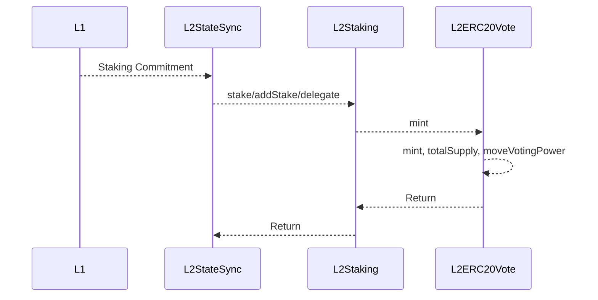
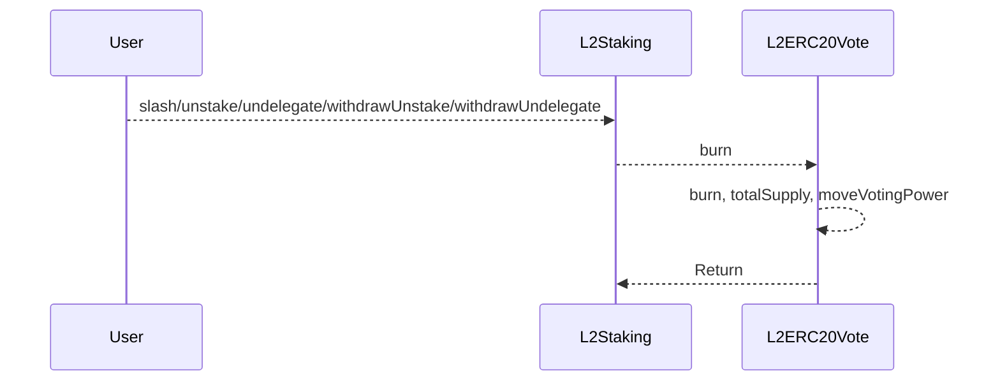
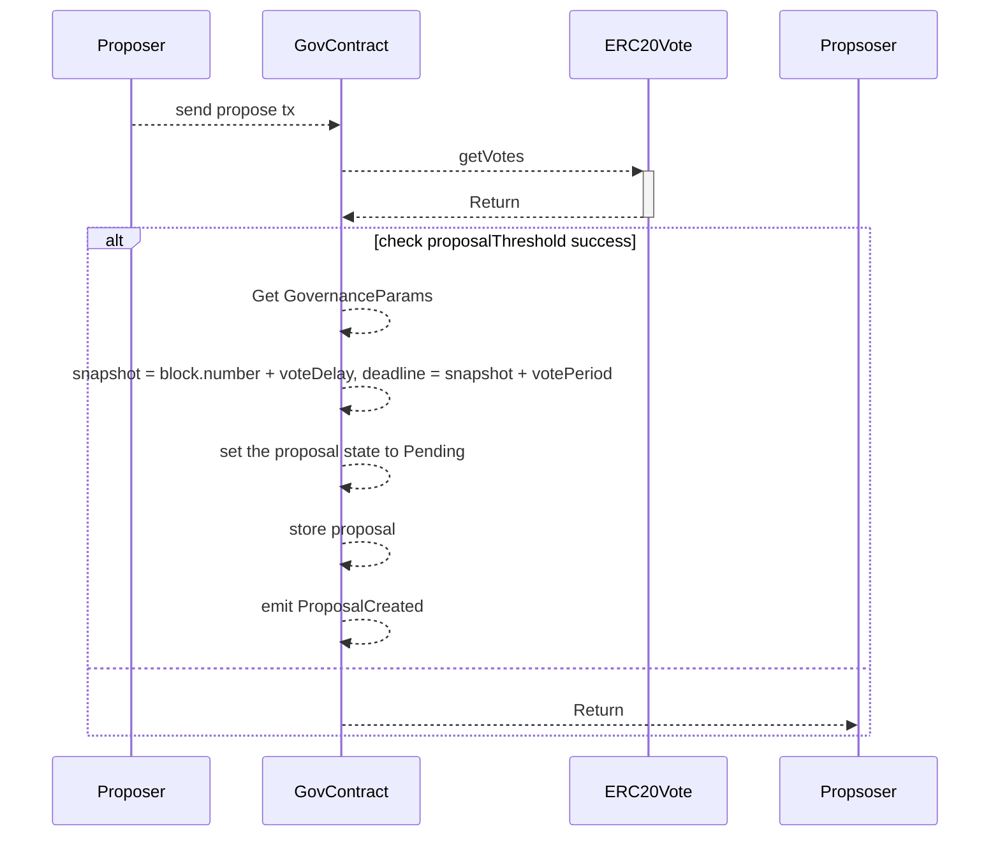
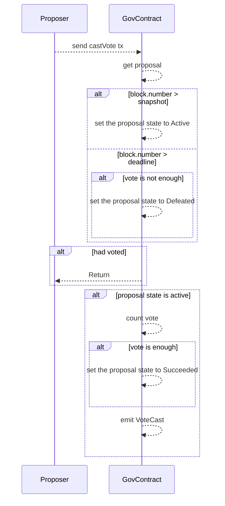
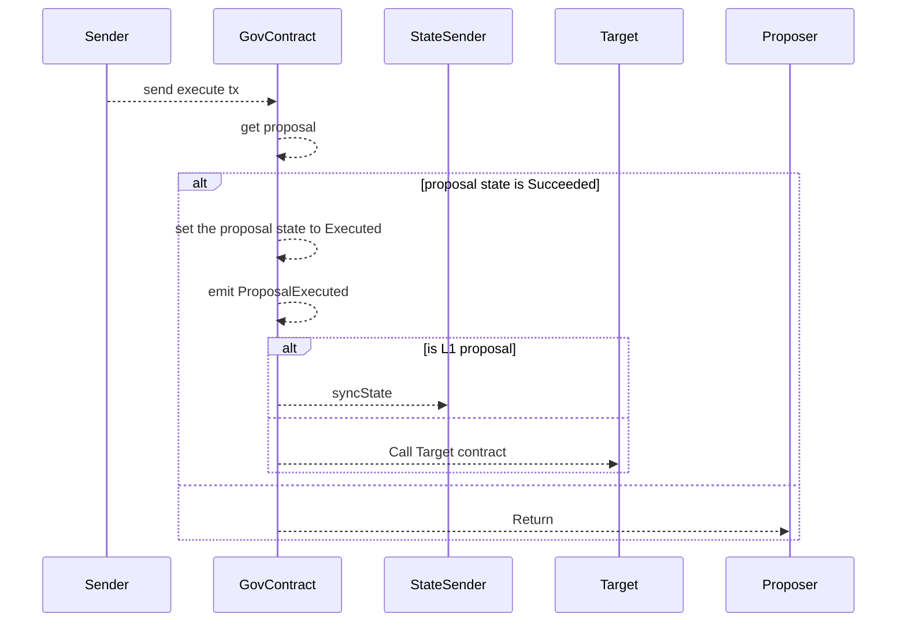
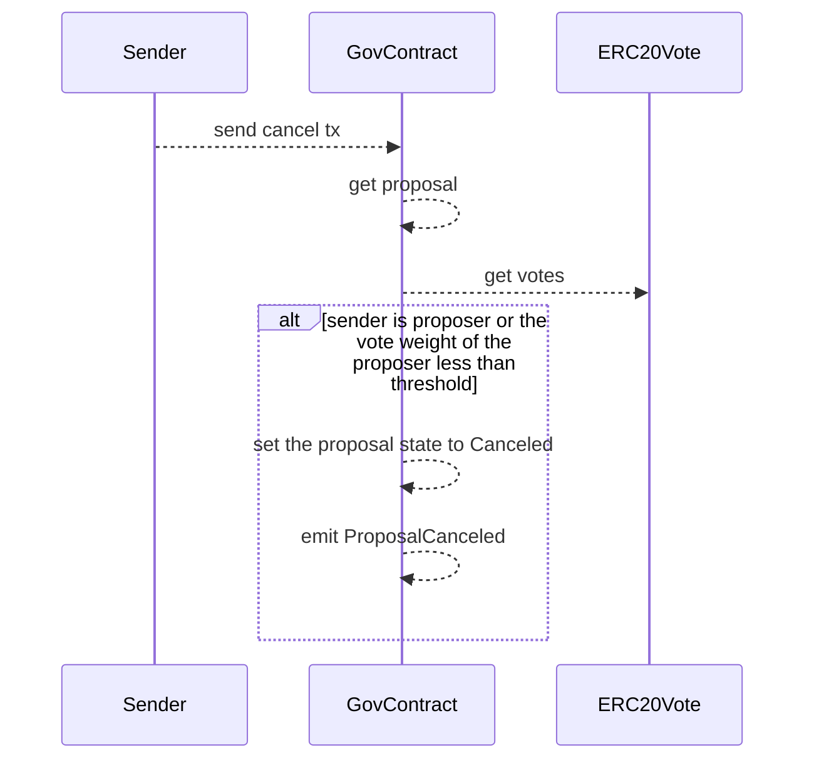

# Governance

治理模块是 AppChain-SDK 提供的基础治理模块，通过治理模块可以提交提案、投票等操作。


## 治理参与者

治理参与者是质押及委托的用户，每次的质押及委托都会调用投票代币合约，通过投票代币合约来计算用户的权重。

## 创世配置

```json
"governance":{
    "name": "gov", //治理合约名字
    "govVersion": "1", //治理版本
    "voteDelay": 10, //投票延时，提案发起后，经过多少区块才能进行投票
    "votePeriod": 10, //投票周期
    "quorumNumerator": 1, //最小提案投票比例1-100
    "proposalThreshold": 123333, //提案人投票权重阈值
    "owner": "lat1qqqqqqqqqqqqqqqqqqqqqqqqqqqqqqqpfr7f80", //治理合约拥有者
    "voteToken": "lat1zqqqqqqqqqqqqqqqqqqqqqqqqqqqqqqtnsk753" //投票代币合约地址，查询参与用户的投票权重
}
```

## 提案流程

治理分为L1、L2治理，L1的治理，需要通过L2的治理合约进行投票，通过checkpoint机制进行提交到L1




## 执行流程

### L2 Staking 账户

* L1->L2 



* L2->L1



Staking 账户调用了 `mint/burn`，资金在 L1->L2、L2->L1 互相流转，没有产生 L2->L2 转账的行为

## 治理提案流程



#### 治理投票流程



#### 治理执行流程



#### 提案取消流程




