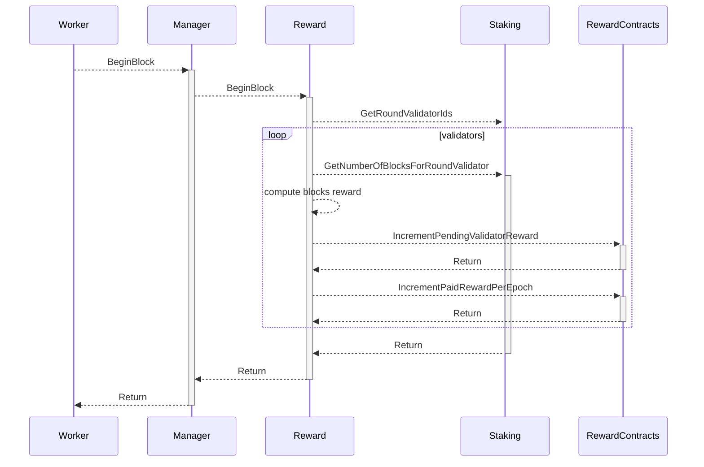
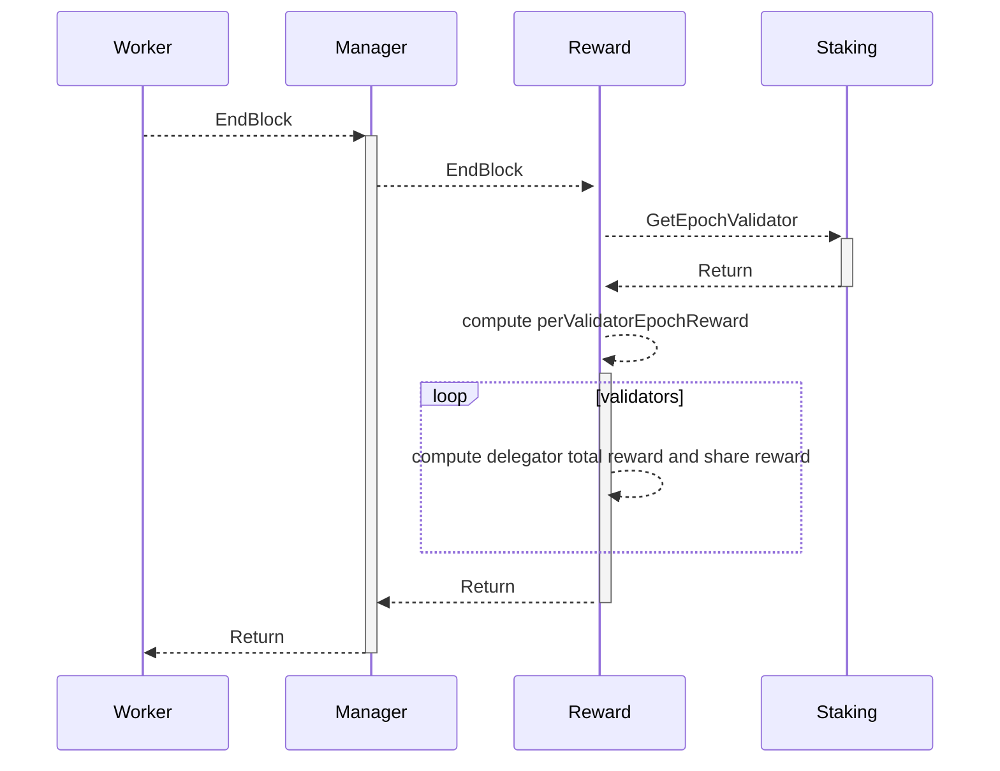

# Reward


奖励模块实现依靠 Staking 模块的质押委托信息，对出块情况进行奖励。奖励的实现方式，利用 BeginBlock、EndBlock , 以及合约模块接口，在BeginBlock 实现对上一个区块的奖励计算，在EndBlock 实现对 整个共识Epoch奖励计算


## 合约

```solidity
interface IRewardManager {
    event RewardDistributed(uint256 indexed epochId, uint256 totalReward);
    event EpochReward(uint256 indexed epochId, address[] validators, uint256[] amounts);
    event BlockReward(uint256 indexed epochId, address[] validators, uint256[] amounts);
    event ValidatorRewardWithdrawal(address indexed validator, uint256 amount, address caller);
    event DelegatorRewardWithdrawal(address indexed validator, uint256 amount, address caller);

    /// @notice withdraws pending rewards for the sender (owner of validator)
    /// @dev only owner of validator call
    function withdrawValidatorRewards(address validator) external;

    /// @notice withdraws pending rewards for the sender (delegator for validator)
    /// @dev only delegator call
    function withdrawDelegatorRewards(address validator) external;

    /// @notice returns the total reward (epoch reward and blocks reward) paid for the given epoch
    function paidRewardPerEpoch(uint256 epochId) external view returns (uint256);

    /// @notice returns the pending reward for the given account(validator)
    function pendingValidatorRewards(address validator) external view returns (uint256);

    /// @notice returns the pending reward of delegator for the given account(validator)
    function pendingDelegatorRewards(address validator, address delegator) external view returns (uint256);
}
```
## 流程

### 区块奖励




* 通过 Worker 调用 Manager EndBlock 接口
* Manager 调用 Staking EndBlock 接口
* Reward 向 Staking 模块获取验证人列表
* 遍历验证人，获取验证人的出块数量，计算奖励，并写入到 RewardContract


### Epoch 奖励




* 通过 Worker 调用 Manager EndBlock 接口
* Manager 调用 Staking EndBlock 接口
* Reward 向 Staking 模块获取验证人列表
* 遍历验证人，获取验证人的出块数量，计算奖励，并写入到 RewardContract