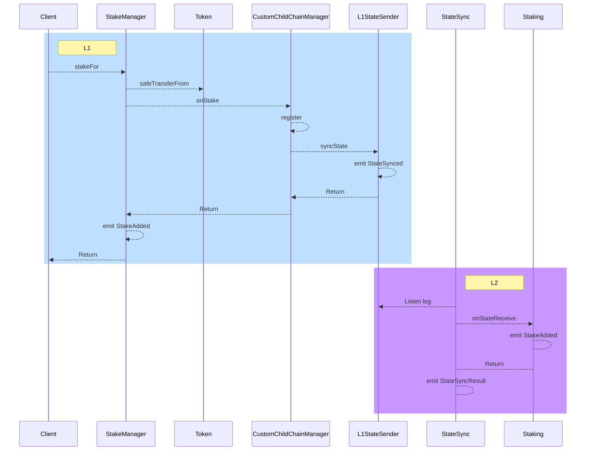
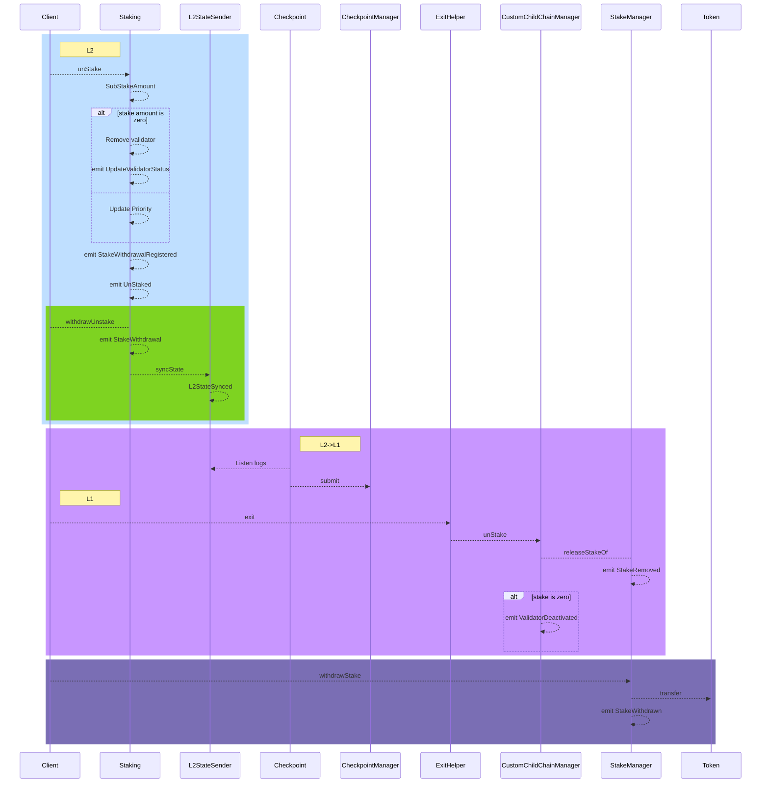
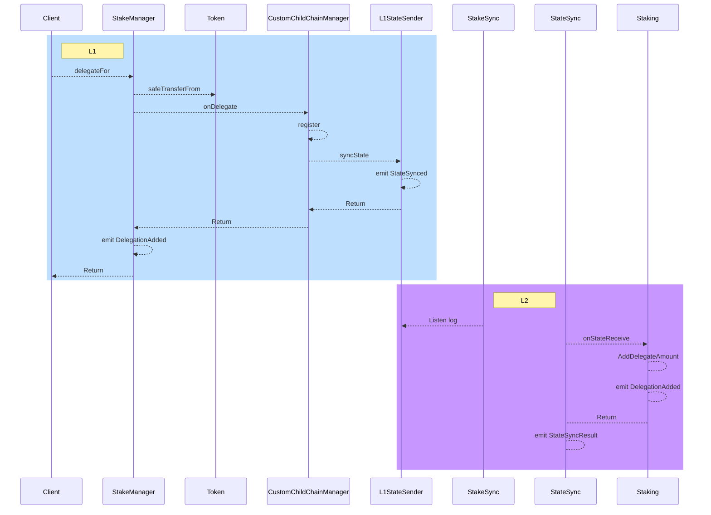
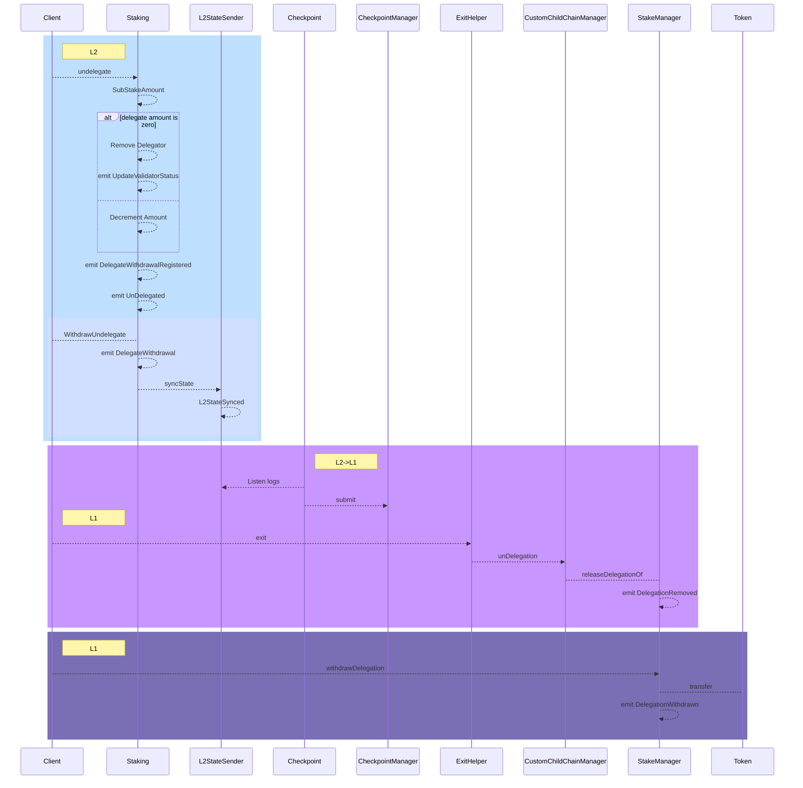
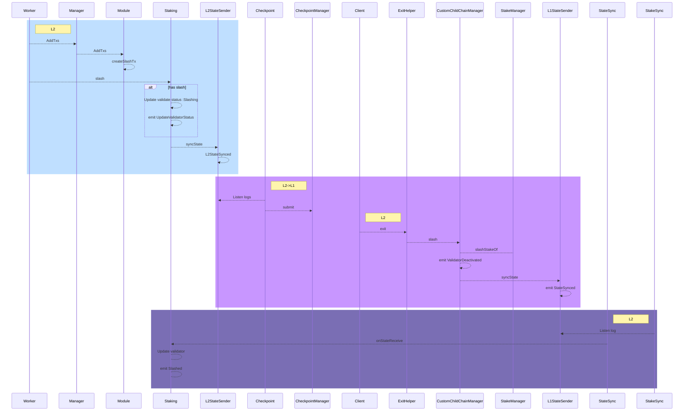
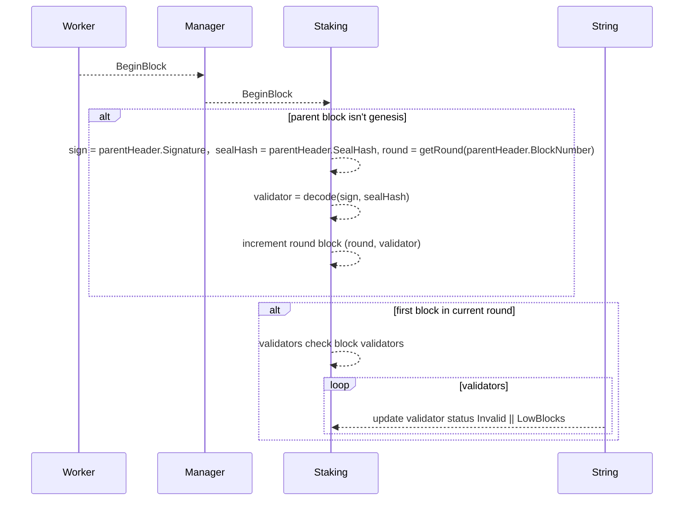
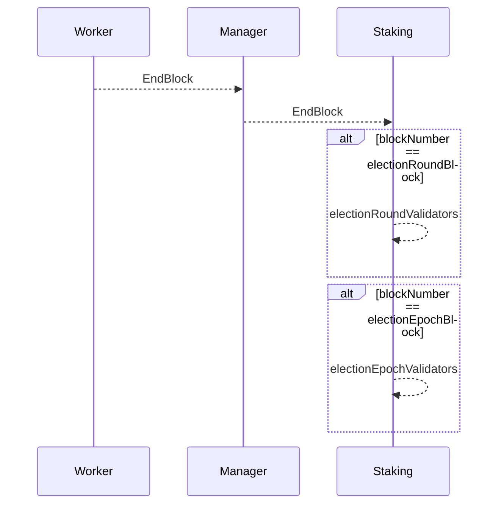
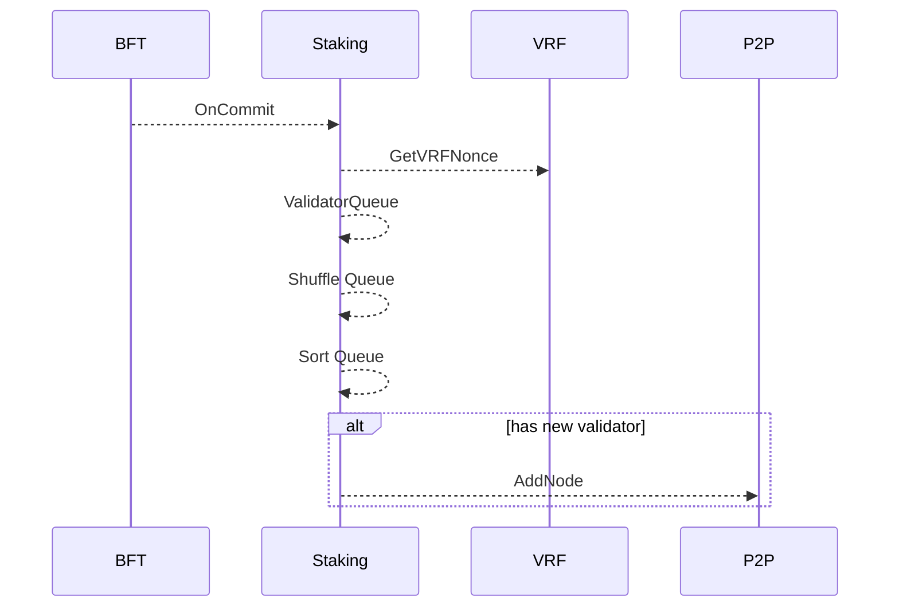

# Staking

（Staking 实现了 选举接口， 使用 VRF 对验证人进行选举，并且对当选的验证人， P2P 连接节点）

Staking 模块实现 PoS 质押、解质押、委托、解委托、惩罚部分，奖励将在 [Reward](./reward.md) 介绍

## 合约

```solidity
struct ValidatorInfo {
    address validatorAddr;
    address owner;
    uint256 stakeAmount;
    uint256 delegateAmount;
    uint256 commissionRate;
    uint256 status;
    uint256 epoch;
    uint256 stakeIndex;
    bytes pubKey;
    bytes blsKey;
}

struct DelegationInfo {
    address validatorAddr;
    address delegatorAddr;
    uint256 amount;
    uint256 stakeEpoch;
    uint256 delegateEpoch;
}

interface IStakeHandler is IL1StateReceiver {
    event Slashed(uint256 indexed exitId, address[] validators, uint256[] amounts);
    event StakeAdded(address indexed validator, uint256 amount);
    event DelegationAdded(address indexed delegator, address indexed validator, uint256 amount);
    event UnStaked(address indexed validator, uint256 amount);
    event UnDelegated(address indexed delegator, address indexed validator, uint256 amount);
    event StakeWithdrawalRegistered(address indexed validator, uint256 amount);
    event StakeWithdrawal(address indexed validator, uint256 amount);
    event DelegateWithdrawalRegistered(address indexed delegator, address indexed validator, uint256 amount);
    event DelegateWithdrawal(address indexed delegator, address indexed validator, uint256 amount);
    event UpdateValidatorStatus(address indexed validator, uint256 status);

    /// @notice initialises slashing process
    /// @dev system call,
    /// @dev given list of validators are slashed on L2
    /// subsequently after their stake is slashed on L1
    function slash() external;

    /// @notice allows a validator to announce their intention to withdraw a given amount of tokens
    /// @dev initializes a waiting period before the tokens can be withdrawn
    /// @param validator the validator unstake for
    /// @param amount the amount unstake for
    function unstake(address validator, uint256 amount) external;

    /// @notice Allow the client to announce their intention to withdraw a fixed quantity of tokens to the validator from the stake
    /// @dev initializes a waiting period before the tokens can be withdrawn
    /// @param validator the validator undelegate for
    /// @param amount the amount undelegate for
    function undelegate(address validator, uint256 amount) external;

    /// @notice allows a validator to complete a withdrawal
    /// @param validator The validator to withdraw amount for
    function withdrawUnstake(address validator) external; // only owner of validator call

    /// @notice allows a delegator to complete a withdrawal with validator
    /// @param validator The validator to withdraw amount for
    function withdrawUndelegate(address validator) external; // only delegator call

    /// @notice Calculates how much can be withdrawn for account in this epoch.
    /// @param validator The account to calculate amount for
    /// @return Amount withdrawable
    function withdrawableOfStake(address validator) external view returns (uint256);

    /// @notice Calculates how much can be withdrawn for account in this epoch.
    /// @param validator The validator to calculate amount for
    /// @param validator The delegator to calculate amount for
    /// @return Amount withdrawable
    function withdrawableOfDelegate(address validator, address delegator) external view returns (uint256);

    /// @notice Calculates how much is yet to become withdrawable for account.
    /// @param validator The validator to calculate amount for
    /// @return Amount not yet withdrawable
    function pendingWithdrawalsOfStake(address validator) external view returns (uint256);

    /// @notice Calculates how much is yet to become withdrawable for account.
    /// @param validator The validator to calculate amount for
    /// @param delegator The delegator to calculate amount for
    /// @return Amount not yet withdrawable
    function pendingWithdrawalsOfDelegate(address validator, address delegator) external view returns (uint256);

    /// @notice Verify the aggregated signature of the validators.
    /// @param blockNumber The number of the block to which the validator list belongs in a period
    /// @param validatorIndexs The index in the list of validators for aggregate signatures
    /// @param data Signature Data Hash
    /// @param signatues Aggregated signatures for validators
    /// @return True is successful
    function verifyAggregateSignature(
        uint256 blockNumber,
        uint256[] calldata validatorIndexs,
        bytes32 data,
        bytes calldata signatues
    ) external view returns (bool);

    /// @notice Verify the aggregated signature of the validators.
    /// @param validators List of validators for aggregated signatures
    /// @param data Signature Data Hash
    /// @param signatues Aggregated signatures for validators
    /// @return True is successful
    function verifyAggregateSignatureByValidators(address[] calldata validators, bytes32 data, bytes calldata signatues)
        external
        view
        returns (bool);

    /// @notice Query the delegation information of the delegator on the validators
    /// @dev Query the delegation information of the delegator on these validators based on the addr list of validators
    /// @param validators addr of validators
    /// @param delegator the delegator
    /// @return DelegationInfo array for query
    function getDelegationsWithValidator(address[] calldata validators, address delegator)
        external
        view
        returns (DelegationInfo[] memory);

    /// @notice Query the list of validators for a certain period
    /// @dev For the convenience of expanding the list of validators with multiple period properties
    /// @param periodType represents a period of a certain type
    /// @param period represents the number of intervals
    /// @return validator address array
    function getValidatorAddrs(uint8 periodType, uint256 period) external view returns (address[] memory);

    /// @notice Query the list of all validators
    /// @dev Support pagination to query the list of all validators
    /// @param start represents the starting query ID. When passing empty bytes, it defaults to starting from the first Id
    /// @param size page size
    /// @return bytes of next start
    /// @return ValidatorInfo array for query
    function getValidators(bytes calldata start, uint256 size)
        external
        view
        returns (bytes memory, ValidatorInfo[] memory);

    /// @notice Query the list of validators by addrs
    /// @dev Support to query the list of validators by addr of validators
    /// @param validators addr of validators
    /// @return ValidatorInfo array for query
    function getValidatorsWithAddr(address[] calldata validators) external view returns (ValidatorInfo[] memory);
}
```

```solidity
contract StakeHandler is IStakeHandler {
    function onStateReceive(uint256 id, address sender, bytes calldata data) external {}

    /// @notice initialises slashing process
    /// @dev system call,
    /// @dev given list of validators are slashed on L2
    /// subsequently after their stake is slashed on L1
    function slash() external {}

    /// @notice allows a validator to announce their intention to withdraw a given amount of tokens
    /// @dev initializes a waiting period before the tokens can be withdrawn
    /// @param validator the validator unstake for
    /// @param amount the amount unstake for
    function unstake(address validator, uint256 amount) external {}

    /// @notice Allow the client to announce their intention to withdraw a fixed quantity of tokens to the validator from the stake
    /// @dev initializes a waiting period before the tokens can be withdrawn
    /// @param validator the validator undelegate for
    /// @param amount the amount undelegate for
    function undelegate(address validator, uint256 amount) external {}

    /// @notice allows a validator to complete a withdrawal
    /// @param validator The validator to withdraw amount for
    function withdrawUnstake(address validator) external {} // only owner of validator call

    /// @notice allows a delegator to complete a withdrawal with validator
    /// @param validator The validator to withdraw amount for
    function withdrawUndelegate(address validator) external {} // only delegator call

    /// @notice Calculates how much can be withdrawn for account in this epoch.
    /// @param validator The account to calculate amount for
    /// @return Amount withdrawable
    function withdrawableOfStake(address validator) external view returns (uint256) {
        return 0;
    }

    /// @notice Calculates how much can be withdrawn for account in this epoch.
    /// @param validator The validator to calculate amount for
    /// @param validator The delegator to calculate amount for
    /// @return Amount withdrawable
    function withdrawableOfDelegate(address validator, address delegator) external view returns (uint256) {
        return 0;
    }

    /// @notice Calculates how much is yet to become withdrawable for account.
    /// @param validator The validator to calculate amount for
    /// @return Amount not yet withdrawable
    function pendingWithdrawalsOfStake(address validator) external view returns (uint256) {
        return 0;
    }

    /// @notice Calculates how much is yet to become withdrawable for account.
    /// @param validator The validator to calculate amount for
    /// @param delegator The delegator to calculate amount for
    /// @return Amount not yet withdrawable
    function pendingWithdrawalsOfDelegate(address validator, address delegator) external view returns (uint256) {
        return 0;
    }

    /// @notice Verify the aggregated signature of the validators.
    /// @param blockNumber The number of the block to which the validator list belongs in a period
    /// @param validatorIndexs The index in the list of validators for aggregate signatures
    /// @param data Signature Data Hash
    /// @param signatues Aggregated signatures for validators
    /// @return True is successful
    function verifyAggregateSignature(
        uint256 blockNumber,
        uint256[] calldata validatorIndexs,
        bytes32 data,
        bytes calldata signatues
    ) external view returns (bool) {
        return true;
    }

    /// @notice Verify the aggregated signature of the validators.
    /// @param validators List of validators for aggregated signatures
    /// @param data Signature Data Hash
    /// @param signatues Aggregated signatures for validators
    /// @return True is successful
    function verifyAggregateSignatureByValidators(address[] calldata validators, bytes32 data, bytes calldata signatues)
        external
        view
        returns (bool)
    {
        return true;
    }

    /// @notice Query the delegation information of the delegator on the validators
    /// @dev Query the delegation information of the delegator on these validators based on the addr list of validators
    /// @param validators addr of validators
    /// @param delegator the delegator
    /// @return DelegationInfo array for query
    function getDelegationsWithValidator(address[] calldata validators, address delegator)
        external
        view
        returns (DelegationInfo[] memory)
    {
        return new DelegationInfo[](0);
    }

    /// @notice Query the list of validators for a certain period
    /// @dev For the convenience of expanding the list of validators with multiple period properties
    /// @param periodType represents a period of a certain type
    /// @param period represents the number of intervals
    /// @return validator address array
    function getValidatorAddrs(uint8 periodType, uint256 period) external view returns (address[] memory) {
        return new address[](0);
    }

    /// @notice Query the list of all validators
    /// @dev Support pagination to query the list of all validators
    /// @param start represents the starting query ID. When passing empty bytes, it defaults to starting from the first Id
    /// @param size page size
    /// @return bytes of next start
    /// @return ValidatorInfo array for query
    function getValidators(bytes calldata start, uint256 size)
        external
        view
        returns (bytes memory, ValidatorInfo[] memory)
    {
        return (bytes(""), new ValidatorInfo[](0));
    }

    /// @notice Query the list of validators by addrs
    /// @dev Support to query the list of validators by addr of validators
    /// @param validators addr of validators
    /// @return ValidatorInfo array for query
    function getValidatorsWithAddr(address[] calldata validators) external view returns (ValidatorInfo[] memory) {
        return new ValidatorInfo[](0);
    }
}
```

## 流程

Staking 模块与 L1 合约组成

### Stake

Stake 增加新的验证人质押



客户端调用 StakeManager 的 stakeFor 函数，StakeManager 调用 Token 合约将质押的代币金额划转到 StakeManager 合约，再次调用 CustomChildChainManager 合约 onStake，CustomChildChainManager 将验证人信息进行注册，触发 StateSynced 事件。

L2 监听到 L1 StateSynced 事件，StateSync 合约调用 Staking 合约 onStateReceive 函数， Staking 触发 StakeAdded 事件，StateSync 获取 Staking 执行结果触发 StateSyncResult

### UnStake

解质押从 L2 发起，到 L1，再到 L2 完成全部流程



* 客户端向 L2 Staking 合约发起 unStake 交易
* Staking 合约将质押金额进行扣减
* 如果质押金额为 0 则进行移除验证人，触发 UpdateValidatorStatus，否则仅更新权重
* 触发 StakeWithdrawalRegistered 验证人提取的质押金额
* 触发 UnStaked 事件
* 客户端向 L2 Staking 合约调用 withdrawUnstake 函数发起质押提取
* Staking 触发 StakeWithdrawal 事件
* Staking 调用 L2StateSender 触发 L2StateSynced 事件
* Checkpoint 模块将提取事件提交到 L1
* 客户端调用 ExitHelper 合约的 exit 函数
* ExitHelper 调用 CustomeChildChainManager 合约的 unStake
* CustomeChildChainManager 再调用 StakeManager 的 releaseStakeOf 函数将质押金释放
* StakeManager 触发 StakeRemoved 事件
* 质押金为零 CustomChildChainManager 将触发 ValidatorDeactivated 移除验证人
* 客户端再次发起交易，向 StakeManager 发起 withdrawStake 
* StakeManager 调用 Token 合约，将代币转给指定接收方
* StakeManager 触发 StakeWithdrawn 事件

### Delegate

委托与质押流程类似



* 客户端调用 StakeManager 合约 delegateFor 接口
* StakeManager 调用 Token 合约将 委托金划转到 StakeManager 合约
* StakeManager 调用 CustomChildChainManager 合约 onDelegate 进行委托信息的注册
* CustomChildChainManager 调用 StateSender 触发 StateSynced 事件
* StakeManager 触发 DelegationAdded 事件
* StateSync 监听到 L1 StateSynced 事件后调用 Staking 合约的 onStateReceive 函数
* 触发 DelegationAdded 事件
* StateSync 将执行结果通过 StateSyncResult 事件触发

### UnDelegate



* 客户端向 L2 Staking 合约发起 undelegate 交易
* Staking 合约将委托金额进行扣减
* 如果委托金额为 0 则进行移除委托人，触发 UpdateValidatorStatus，否则仅扣减金额
* 触发 DelegateWithdrawalRegistered 委托人提取的质押金额
* 触发 UnDelegated 事件
* 客户端向 L2 Staking 合约调用 WithdrawUndelegate 函数发起质押提取
* Staking 触发 DelegateWithdrawal 事件
* Staking 调用 L2StateSender 触发 L2StateSynced 事件
* Checkpoint 模块将提取事件提交到 L1
* 客户端调用 ExitHelper 合约的 exit 函数
* ExitHelper 调用 CustomeChildChainManager 合约的 unDelegation
* CustomeChildChainManager 再调用 StakeManager 的 releaseDelegationOf 函数将质押金释放
* StakeManager 触发 DelegationRemoved 事件
* 客户端再次发起交易，向 StakeManager 发起 withdrawDelegation 
* StakeManager 调用 Token 合约，将代币转给指定接收方
* StakeManager 触发 DelegationWithdrawn 事件
  
### Slash



* Worker 调用 Manager 的 AddTxs 接口
* Manager 调用实现 Staking 模块
* 添加 Slash 交易
* 执行 惩罚，并触发 UpdateValidatorStatus 事件
* 调用 L2StateSynced 触发事件
* Checkpoint 将 L2StateSynced 事件提交到 L1
* 客户端调用 ExitHelper 的 exit 接口
* ExitHelper 调用 CustomChildChainManager 的 slash
* CustomChildChainManager 调用 slashStakeOf 接口
* CustomChildChainManager 触发 ValidatorDeactivated 事件
* L1StateSender 触发 StateSynced 事件
* L2 StakeSync 监听到 L2 事件， 调用 Staking 合约 onStateReceive
* Staking 更新验证人， 触发 Slashed 事件

## BeginBlock & EndBlock

Staking 模块 实现了 BeginBlock 和 EndBlock 接口，在 BeginBlock 实现记录每个验证人出块率，EndBlock 实现验证人的选举



* 通过 Worker 调用 Manager BeginBlock 接口
* Manager 调用 Staking BeginBlock 接口
* 通过父区块的签名及 sealHash 计算出父区块的出块人地址，对该出块人的出块数进行自增
* 判断当前为新 round，则对上一轮没有达到出块数量的验证人进行惩罚


* 通过 Worker 调用 Manager EndBlock 接口
* Manager 调用 Staking EndBlock 接口
* 区块高度为下一轮选举验证的块高，则选择下一轮验证人
* 区块高度为下一轮选举验证的块高，则选择下一结算周期的候选验证人集合，
## 选举

Staking 模块实现选举相关接口，选举利用质押委托相关数据，结合 VRF 选出下一轮验证人，新增加的验证人会尝试进行 P2P 连接，确保在下一轮共识，验证人之间网络的稳定性


