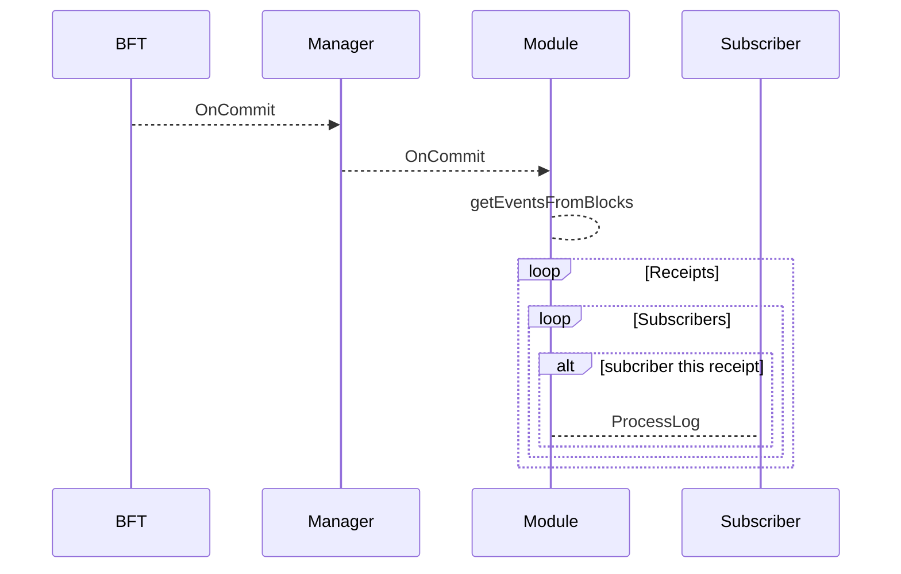

# StateEvent


StateEvent 用于过滤L2区块的事件，其它模块可以向 StateEvent 进行事件订阅，来获取新上链事件。 StateEvent 实现 OnCommit 模块接口




## 接口

StateEvent 提供 事件订阅的注册接口，其它模块可以通过实现EventSubscriber，调用 Subscribe 注册到 StateEvent 模块

```go
// EventSubscriber specifies functions needed for a component to subscribe to stateEvent
type EventSubscriber interface {
	// GetLogFilters returns a map of log filters for getting desired events,
	// where the key is the address of contract that emits desired events,
	// and the value is a slice of signatures of events we want to get.
	GetLogFilters() map[common.Address][]common.Hash

	// ProcessLog is used to handle a log defined in GetLogFilters, provid
	ProcessLog(ctx sdk.ConsensusContext, header *coretypes.Header, qc *ctypes.QuorumCert, log *coretypes.Log) error
}
func Subscribe(subscriber EventSubscriber)
```

## 存储

```go
name = "eventState"
```

保存上次扫描区块的块高

```go
var LastProcessedEventBlockKey = []byte("lastProcessedEventBlockKey")

func (s *Storage) InsertLastProcessedEventBlock(blockNumber uint64) error {
	result := make([]byte, 8)
	binary.BigEndian.PutUint64(result, blockNumber)
	return s.store.Set(types.LastProcessedEventBlockKey, result)
}

func (s *Storage) GetLastProcessedEventsBlock() (uint64, error) {
	result, err := s.store.Get(types.LastProcessedEventBlockKey)
	if err != nil {
		return 0, err
	}
	if len(result) > 0 {
		return binary.BigEndian.Uint64(result), nil
	}
	return 0, nil
}
```
