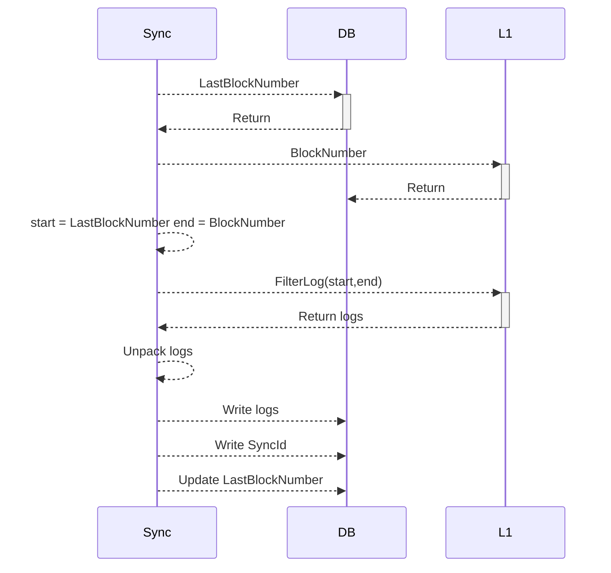
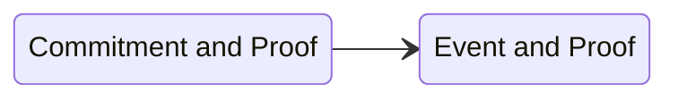
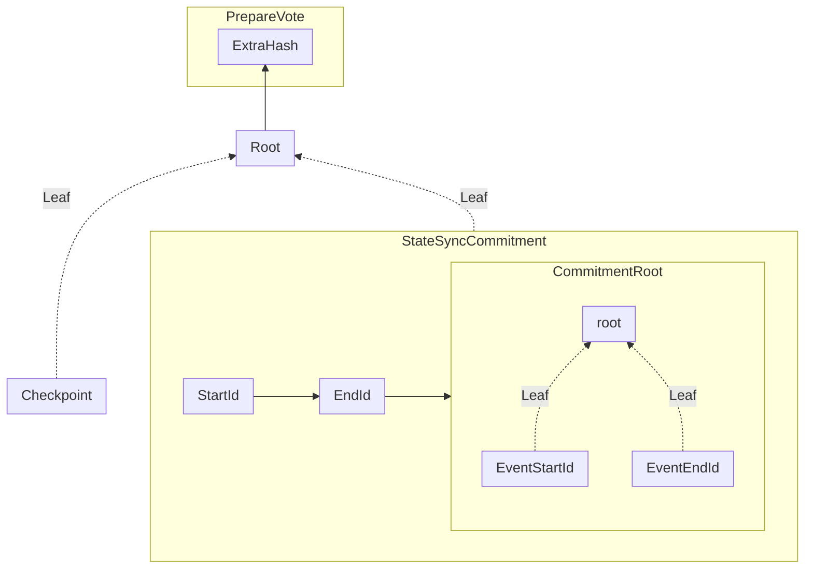
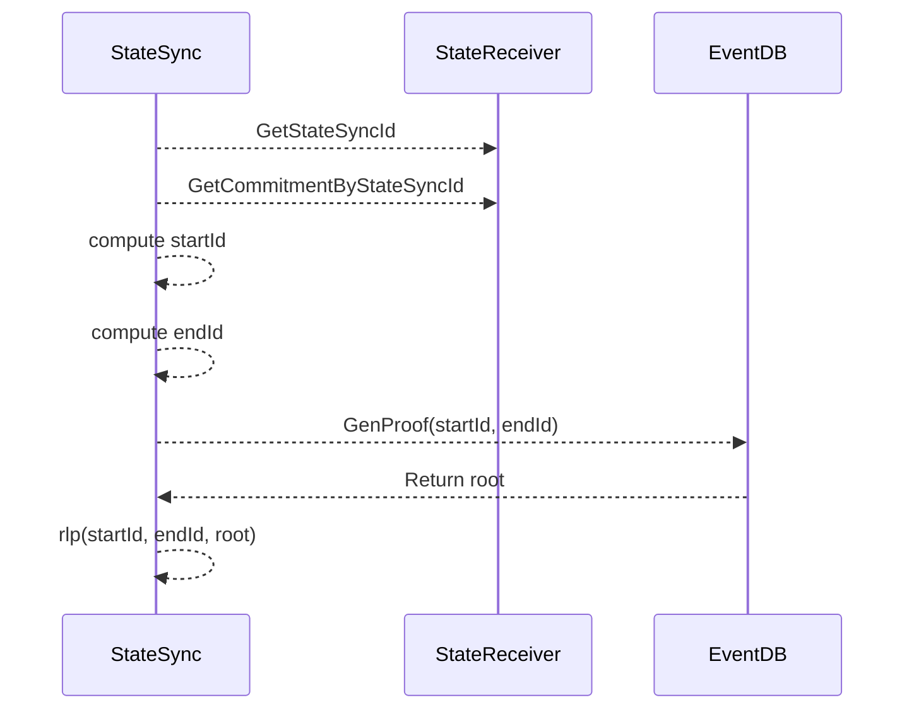
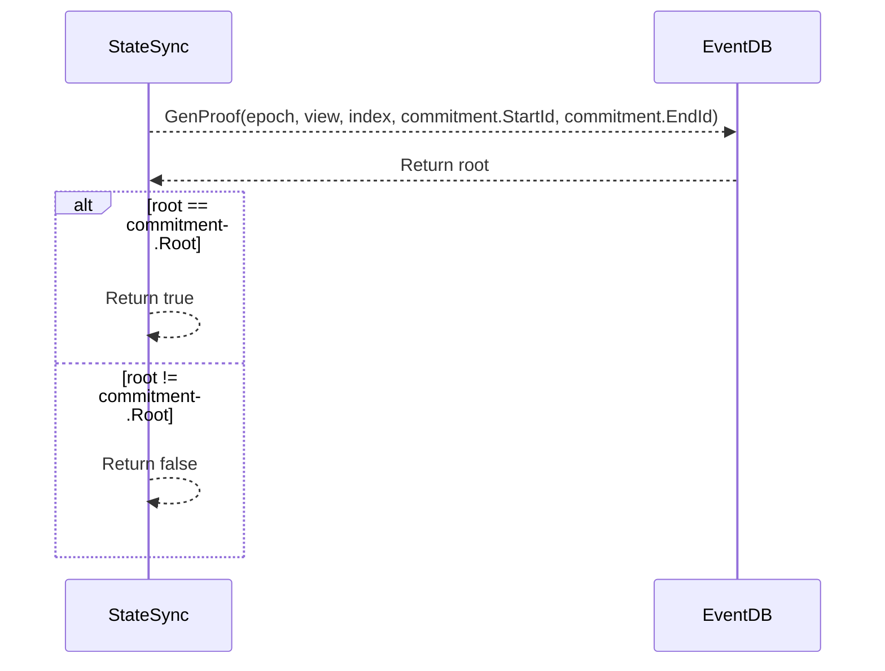
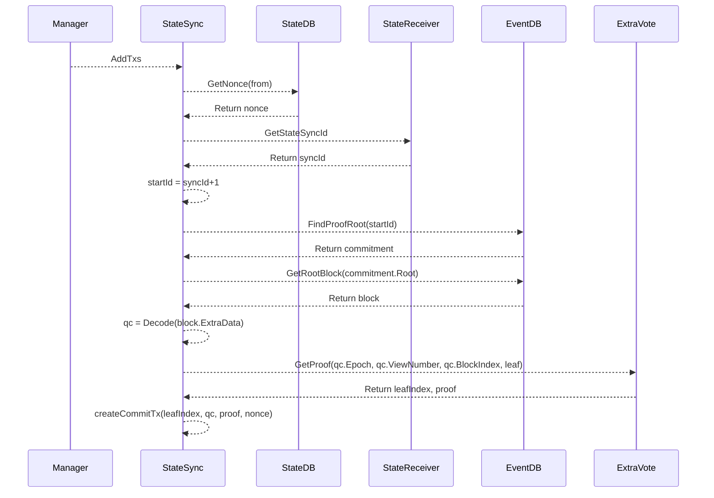
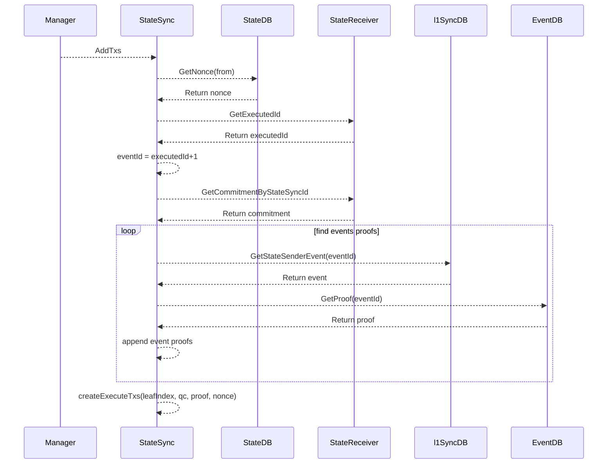

# StateSync

StateSync 模块负责将 L1 StateSender 合约事件同步到 L2 并执行

## 实现

### L1 同步

#### StateSender 合约

```go title="https://github.com/PlatONnetwork/Appchain-Contracts/blob/v1.0.0/src/rootchain/StateSender.sol"
event StateSynced(uint256 indexed id, address indexed sender, address indexed receiver, bytes data);
```

StateSync 模块监听 L1 StateSender 合约的 StateSynced 事件

* id 自增 id 每个事件 id 唯一
* sender 事件发送者
* receiver L2 的合约接收地址
* data 调用 receiver 合约函数及参数字节流

#### 同步

同步 L1 事件流程



#### DB

同步的事件通过 DB 可查询，DB 会记录当前同步的事件中 id 的最大值，查询也通过 id 来进行查询

```go
var (
	L1SyncDBName = "l1sync"
	lastBlockKey = []byte("lastBlock")
	maxSyncKey   = []byte("maxSyncId")
	eventKey     = []byte("event")
	batchSize    = 1024 * 1024
)

func encodeEventKey(id *big.Int) []byte {
	return append(eventKey, math.PaddedBigBytes(id, 32)...)
}

func decodeEventKey(key []byte) *big.Int {
	return new(big.Int).SetBytes(key[len(eventKey):])
}
```

```go
// 设置最近同步的区块高度
func (l *L1SyncDB) SetLastBlockNumber(start *big.Int) error {
}
// 获取最近同步的区块高度
func (l *L1SyncDB) LastBlockNumber() (*big.Int, error) {
}
// 设置最近同步的事件最大 id
func (l *L1SyncDB) SetMaxSyncId(id *big.Int) error {
}
// 获取最近同步的事件最大 id
func (l *L1SyncDB) GetMaxSyncId() (*big.Int, error) {
}
// 写入事件
func (l *L1SyncDB) WriteStateSenderEvent(events []*StateSender) error {

}
// 清理历史事件，参数为清理的最大事件 id
func (l *L1SyncDB) ClearStateSenderHistory(target *big.Int) error {

}
// 查询指定事件 id 范围的事件
func (l *L1SyncDB) FindStateSenderEvent(start *big.Int, end *big.Int) ([]*StateSender, error) {

}
// 查询指定事件 id 的事件
func (l *L1SyncDB) GetStateSenderEvent(start *big.Int) (*StateSender, error) {

}

```
### P2P

StateSync 实现的 P2P 相关模块接口，StateSync 模块主要同步共识节点间的同步情况，确保在进行共识的数据，各个共识节点可以进行验证。P2P 只有一个用于同步事件 id 的心跳包

```go
type Heartbeat struct {
	sdkp2p.MessageCode
	SyncStatus
}

type SyncStatus struct {
	Id          *big.Int // 节点同步事件的最大 Id
	BlockNumber *big.Int // 节点同步的最大区块高度
}
```

P2P 对外提供获取 QuorumSyncId 接口，用于获取当前验证节点网络的有效 id，便于在提议 id 的合理性

```go
func GetQuorumSyncId(validPeers map[string]struct{}) *big.Int
```

### 合约

先看 L2 合约的 Solidity 代码框架

```go title="x/statesync/contracts/sol/StateReceiver.sol"
    // 对应 L1 StateSynced 事件
    struct StateSync {
        uint256 id;
        address sender;
        address receiver;
        bytes data;
    }
    // 提交的 commitment
    struct StateSyncCommitment {
        uint256 startId;
        uint256 endId;
        bytes32 root;
    }
	// 用于 BLS 签名，通过 BitArray 获取签名由那些验证人签署
    struct BitArray {
        uint32 bits;
        uint64[] Elems;
    }
	// Quorum 投票
    struct QuorumCert {
        uint64 epoch;
        uint64 viewNumber;
        bytes32 blockHash;
        uint64 blockNumber;
        uint32 blockIndex;
        bytes32 extendHash;
        bytes signature;
        BitArray validatorSet;
    }
contract StateReceiver {

    // L1 事件同步到 L2 执行后会触发此事件
    event StateSyncResult(uint256 indexed counter, bool indexed status, bytes message);
	// 提交的 Commitment 触发此事件
    event NewCommitment(uint256 indexed startId, uint256 indexed endId, bytes32 root);
    // 提交 commitment，index 为 ExtraVote 中 merkle 树叶子索引，commitment 在 ExtraVote merkle 树中的证明，包含此 commitment 的 PrepareQC
    function commit(
        StateSyncCommitment calldata commitment,
        uint64 index,
        byte32[] proof,
        QuorumCert calldata qc,
    ) external {}
    
    function execute(bytes32[] calldata proof, StateSync calldata obj) external {}
    function batchExecute(bytes32[][] calldata proofs, StateSync[] calldata objs) external{}
    function getExecutedId() external view returns(uint256){}
    function getStateSyncId() external returns(uint256){}
    function getRootByStateSyncId(uint256 id) external view returns (bytes32){}
    function getCommitmentByStateSyncId(uint256 id) public view returns (StateSyncCommitment memory){}
}
```

### 共识

同步提交的 Commitment 需要利用 Giskard-BFT 的共识投票提交到合约。先看 StateSync 的 ExtraData，

```go title="x/statesync/contract/statereceiver.go"
type StateSyncCommitment struct {
	StartId *big.Int
	EndId   *big.Int
	Root    common.Hash
}
```
StartId 起始 id，对应事件中 id 字段
EndId 结束 id，对应事件中 id 字段
Root StartId~EndId 所有事件构成的 Merkle 树

事件在 L2 执行需要经过两个阶段，提交 Commitment 及证明 ，提交事件及证明



我们从 Merkle 证明关系图看 Commitment 及事件的证明逻辑



当提交的 Commitment 时， 提交的是 Checkpoint 等与 StateSyncCommitment 的 Merkle 证明。执行事件时则需要提交 StartId 到 EndId 组成的 Merkle 树证明

## L2 提交

下图说明 Commitment 及事件 Merkle 证明如何提交





下图说明如何提交commitment及事件交易


提交 commitment



提交L1 事件
