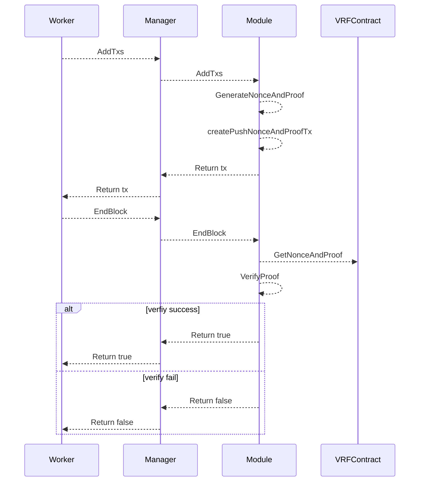

# VRF

VRF 是 SDK 的重要组成部分，在验证人选举、应用合约随机数的使用都发挥作用。VRF 模块实现了模块的 InitGenesis、AddTxs、EndBlock、合约接口。

## 流程



每个区块都会将出块人的 VRF 交易打包进区块，并且在区块执行的 EndBlock 阶段对提交的 VRF 交易进行验证


## VRF 合约


```solidity title="x/vrf/contracts/sol/IVRFManager.sol"
interface IVRFManager {
    event VRFNonceAdded(uint256 indexed block, bytes nonce);

    /// @notice push vrf nonce
    /// @dev validator call,
    /// @param nonceAndProof 81 byte, nonce and proof, flag |nonce |proof, 1byte|32byte|48byte
    function pushNonceAndProof(bytes calldata nonceAndProof) external;
}
```
