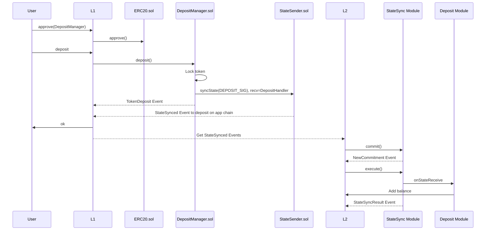
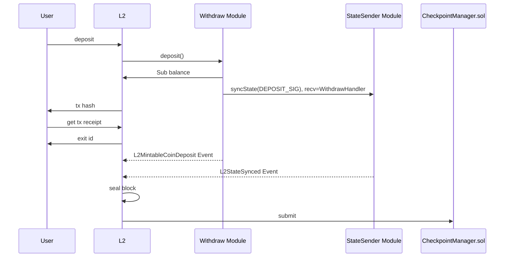
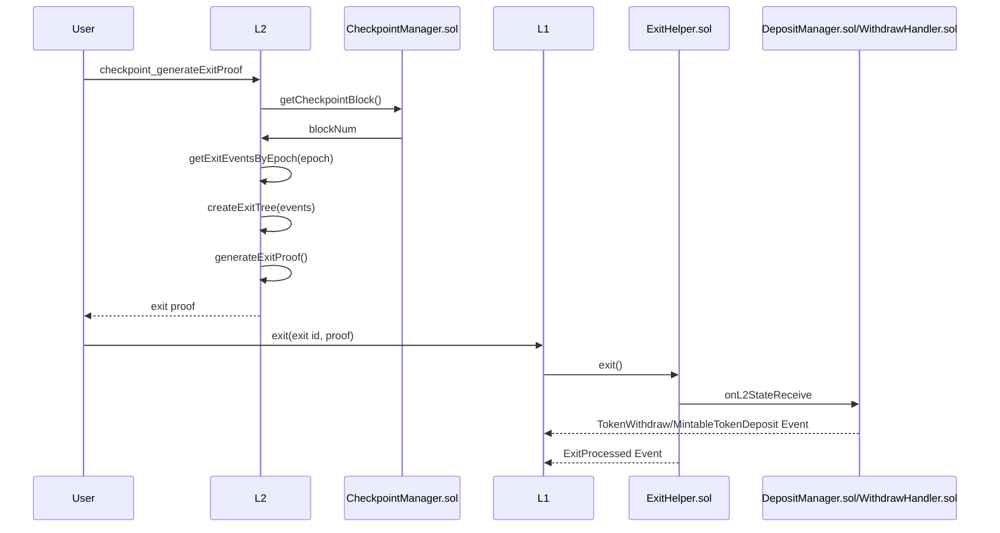

# Sequences

## L1发行

L1发行的ERC-20代币通过桥从L1到L2。

```mermaid
sequenceDiagram
    User->>L1: approve(DepositManager)
    L1->>ERC20.sol: approve()
    User->>L1: deposit
    L1->>DepositManager.sol: deposit()
    DepositManager.sol->>DepositManager.sol: Lock token
    DepositManager.sol->>StateSender.sol: syncState(DEPOSIT_SIG), recv=DepositHandler
    DepositManager.sol-->>L1: TokenDeposit Event
    StateSender.sol-->>L1: StateSynced Event to deposit on app chain
    L1->>User: ok
    L1-->>L2: Get StateSynced Events
    L2->>StateSync Module: commit()
    StateSync Module-->>L2: NewCommitment Event
    L2->>StateSync Module: execute()
    StateSync Module->>Deposit Module: onStateReceive
    Deposit Module->>L2: Add balance
    StateSync Module-->>L2: StateSyncResult Event
```

## L2发行

L2发行的代币通过桥从L2到L1。

```mermaid
sequenceDiagram
    User->>L2: deposit
    L2->>Withdraw Module: deposit()
    Withdraw Module->>L2: Sub balance
    Withdraw Module->>StateSender Module: syncState(DEPOSIT_SIG), recv=WithdrawHandler
    L2->>User: tx hash
    User->>L2: get tx receipt
    L2->>User: exit id
    Withdraw Module-->>L2: L2MintableCoinDeposit Event
    StateSender Module-->>L2: L2StateSynced Event
    L2->>L2: seal block
    L2->>CheckpointManager.sol: submit
```

## Exit

完成将L2 ERC-20代币提取到L1。

```mermaid
sequenceDiagram
    User->>L2: checkpoint_generateExitProof
    L2->>CheckpointManager.sol: getCheckpointBlock()
    CheckpointManager.sol->>L2: blockNum
    L2->>L2: getExitEventsByEpoch(epoch)
    L2->>L2: createExitTree(events)
    L2->>L2: generateExitProof()
    L2-->>User: exit proof
    User->>L1: exit(exit id, proof)
    L1->>ExitHelper.sol: exit()
    ExitHelper.sol->>DepositManager.sol/WithdrawHandler.sol: onL2StateReceive
    DepositManager.sol/WithdrawHandler.sol-->>L1: TokenWithdraw/MintableTokenDeposit Event
    ExitHelper.sol-->>L1: ExitProcessed Event
```
