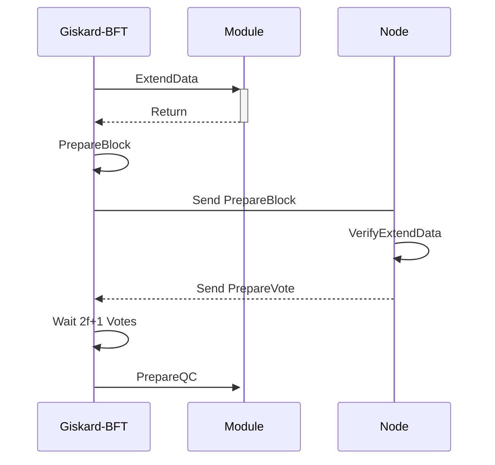

# 共识

AppChain-SDK 采用与主链相同的 Giskard-BFT 共识，其通过并行拜占庭容错共识的方式出块，出块和区块检验并行进行，在保障 BFT 三分之一容错性的同时，极大地提高了出块速率。AppChain-SDK 也对其进行扩展，将 Giskard-BFT 应用到更广泛的场景中，如预言机、协同计算、数据调度等等

# 共识扩展

为了利用验证人 BFT 签名特性，AppChain-SDK 对 Giskard-BFT 共识进行扩展，满足开发者多种签名需求，如增加预言机模块，数据协同验证等

基于 Giskard-BFT 消息结构，对消息包进行修改

```go
type PrepareBlock struct {
    ......
    ExtendData []byte
}
type PrepareVote struct {
    ......
    ExtendHash common.Hash `json:"extendHash"`
}
type QuorumCert struct {
    .....
	ExtendHash   common.Hash     `json:"extendHash"`
	Signature    Signature       `json:"signature"`
	ValidatorSet *utils.BitArray `json:"validatorSet"`
}
type EvidencePrepare struct {
    ExtendData   common.Hash      `json:"extendData"`
}
type EvidenceVote struct {
    ExtendHash   common.Hash      `json:"extendHash"`
}
```

PrepareBlock 消息结构增加 ExtendData 字段，投票阶段 PrepareVote 增加扩展数据的 hash 字段 ExtendHash，QC 过程中 QuorumCert 同样增加 ExtendHash，作恶证据中 EvidencePrepare 增加 ExtendData对应PrepareBlock中的ExtendData字段，
作恶投票证据中 EvidenceVote 增加 ExtendHash


共识中提供模块接口供模块访问

```go
ExtendData(ctx ConsensusContext) []byte
VerifyExtendData(ctx ConsensusContext, data []byte) (common.Hash, error)
PrepareQC(ctx ConsensusContext, block *protocols.PrepareBlock, votes map[uint32]*protocols.PrepareVote)
```

## 流程



* 产生提议的 Block 后，Giskard-BFT 调用 Module 的 ExtendData 获取扩展数据后够造 PrepareBlock BFT 消息
* 节点将 PrepareBlock 广播给其它共识节点
* 节点收到 PrepareBlock，调用 VerifyExtendData 验证，后签名产生 PrepareVote 并广播
* 节点收到 PrepareBlock 的 2f+1 投票，调用 PrepareQC 接口传递到模块


##