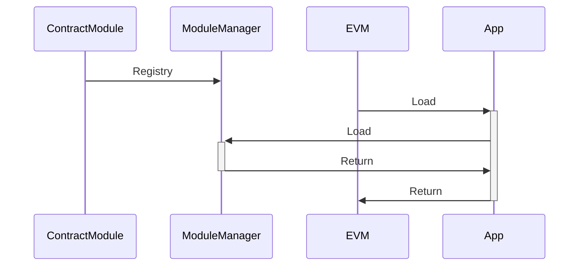

# 合约模块

合约模块是利用 Go 语言实现智能合约，合约模块利用 Solidity ABI 规范提供对外接口，用户可与 Solidity 合约相同的使用体验。

## 方案

### 合约模块加载



* 合约模块注册到 ModuleManager
* EVM 虚拟机启动调用App Contracts接口加载
* App 调用 ModuleManager获取注册的合约模块

合约模块

### 调用流程
合约模块利用 PlatON-Go 预编译合约的加载逻辑，将合约模块加入到 VM 中。

````mermaid
sequenceDiagram
    StateProcessor->>+EVM:Call
    opt Is ContractModule
    EVM->>+ContractModule:Run
    ContractModule->>+Function:Call
    Function-->>-ContractModule:Return
    ContractModule-->>-EVM:Return
    end
    EVM-->>-StateProcessor:Return
    
````

* StateProcessor 将参数传入EVM
* EVM 判断地址是否是合约模块地址
* 合约模块根据交易参数，调用具体合约函数

### Gas 计费

AppChain SDK 中没有对函数进行计费，只针对 State 相关动作进行计费

* 创建账号
* 账户代币
* 账户 Nonce
* 合约 Code
* 合约数据
* 事件触发

