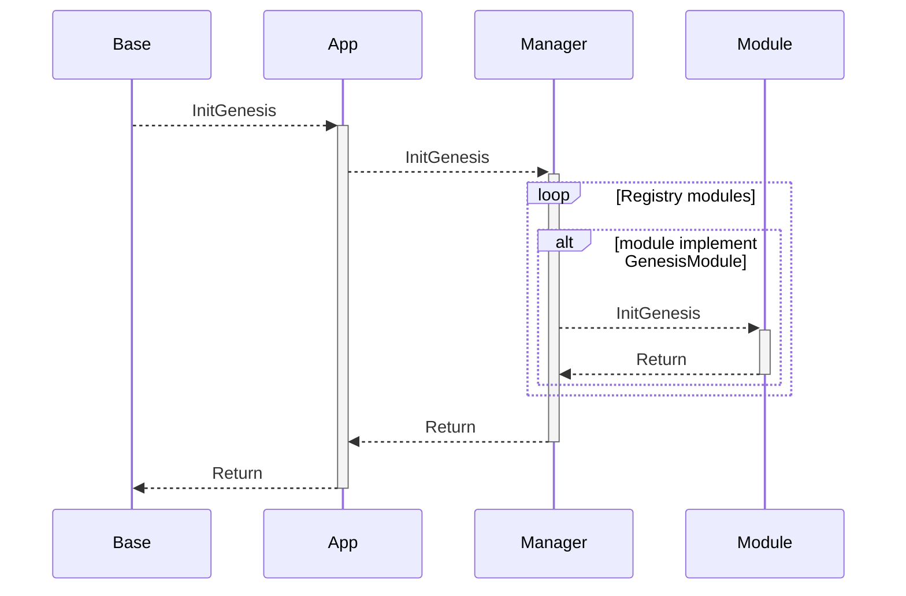
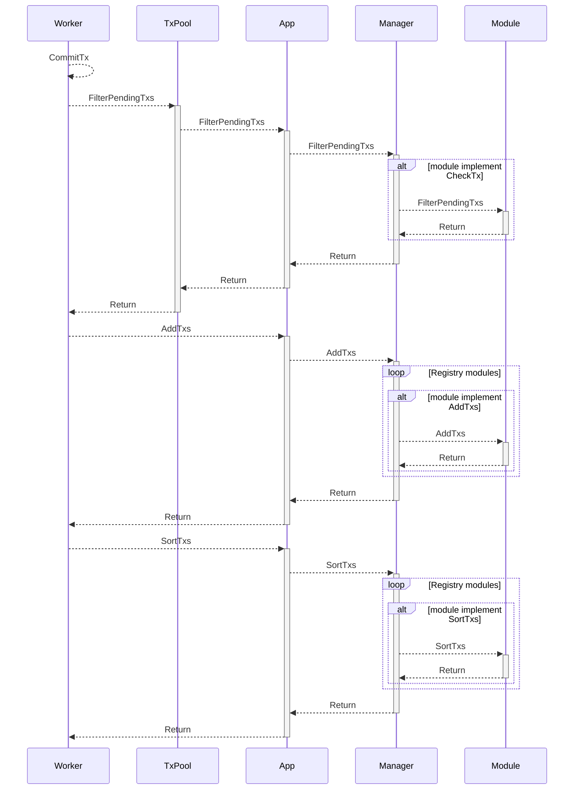
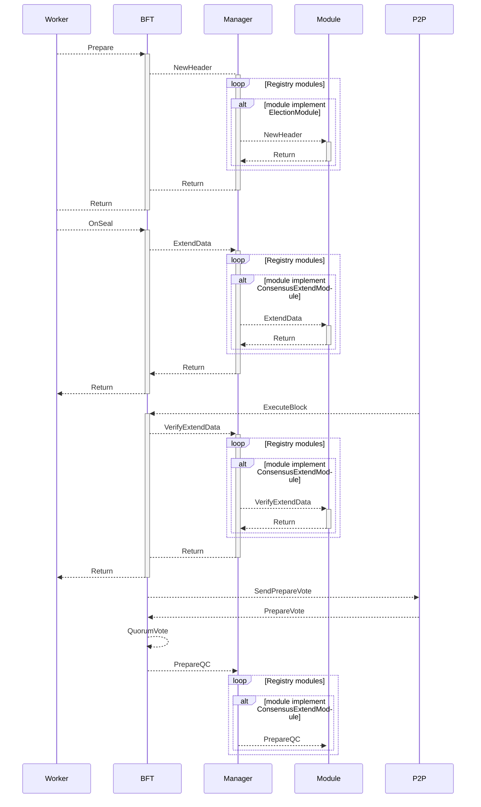
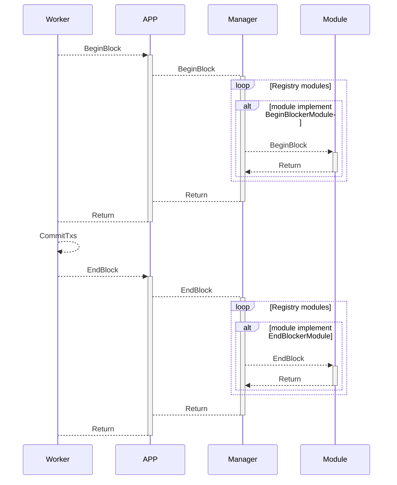

# 功能模块

功能模块提供对链功能的扩展，包括创世、交易、RPC、P2P、共识、区块

## 创世

创世 模块有 GenesisModule 接口

```go
type GenesisModule interface {
	Module
	InitGenesis(ctx sdk.Context, db sdk.StateDB, chainConfig *params.ChainConfig, data json.RawMessage) error
}
```

* ctx 上下文
* db 可以对 StateDB 进行修改
* chainConfig 读取链配置
* data 指定模块的创世参数

创世需要对底层及模块进行初始化，下面是AppChain 初始化过程



* 底层调用App的扩展接口 InitGenesis

* Manager 实现了 App 的扩展接口也管理注册的Module

* Manager 循环调用实现了 GenesisModule 接口的 Module

## 交易

针对交易，Module 有以下接口

```go
type TxPoolModule interface {
	Module
	CheckTx(ctx sdk.Context, tx *types.Transaction) error
	FilterPendingTxs(ctx sdk.Context, txs map[common.Address]types.Transactions) map[common.Address]types.Transactions
}

type WorkerModule interface {
Module
SortTxs(ctx sdk.WorkerContext, local map[common.Address]types.Transactions, remote map[common.Address]types.Transactions) (types.Transactions, error)
}

type TransactionModule interface {
Module
AddTxs(ctx sdk.WorkerContext, local map[common.Address]types.Transactions) (map[common.Address]types.Transactions, error)
}
```

我们在交易池、区块打包部分增加了接口， 交易池的CheckTx、FilterPendingTxs 用于管理交易的入口检查及提供给区块的交易。在区块打包 AddTxs 增加模块的自有交易（如针对内置的合约模块发送零费用的交易），SortTxs 则可以对交易进行重新排序。详细使用可以参考构建部分




## RPC

```go
type RpcModule interface {
	Module
	APIs() []rpc.API
}
```

模块实现APIs 接口，即可实现自定义RPC方法

## P2P

```go
type P2PModule interface {
	Module
	Protocols() []p2p.Protocol
}
```

模块实现 Protocols 接口，即可实现自定义RPC方法


## 共识

```go
type ConsensusExtendModule interface {
	Module
	ExtendData(ctx sdk.ConsensusContext) []byte
	VerifyExtendData(ctx sdk.ConsensusContext, data []byte) (common.Hash, error)
	PrepareQC(ctx sdk.ConsensusContext, block *protocols.PrepareBlock, votes map[uint32]*protocols.PrepareVote)
}

type BlockCommiter interface {
    Module
    OnCommit(ctx sdk.ConsensusContext, block *types.Block) error
}

type ElectionModule interface {
    Module
    NewHeader(ctx sdk.ConsensusContext, header *types.Header) error
    GetLastNumber(ctx sdk.ConsensusContext, blockNumber uint64) uint64
    GetValidator(ctx sdk.ConsensusContext, blockNumber uint64) (*cbfttypes.Validators, error)
    IsCandidateNode(ctx sdk.ConsensusContext, nodeID enode.IDv0) bool
}
```



GetLastNumber 则是用于判断指定块高所属的Epoch最后一个区块高度
GetValidator 根据块高获取当前验证人集合
IsCandidateNode 判断指定网络ID是否是候选人


## 区块


```go
type BeginBlockerModule interface {
	Module
	BeginBlock(ctx sdk.WorkerContext) error
}

type EndBlockerModule interface {
	Module
	EndBlock(ctx sdk.WorkerContext) error
}
```
BeginBlock、EndBlock 用于对区块的执行前后进行扩展



