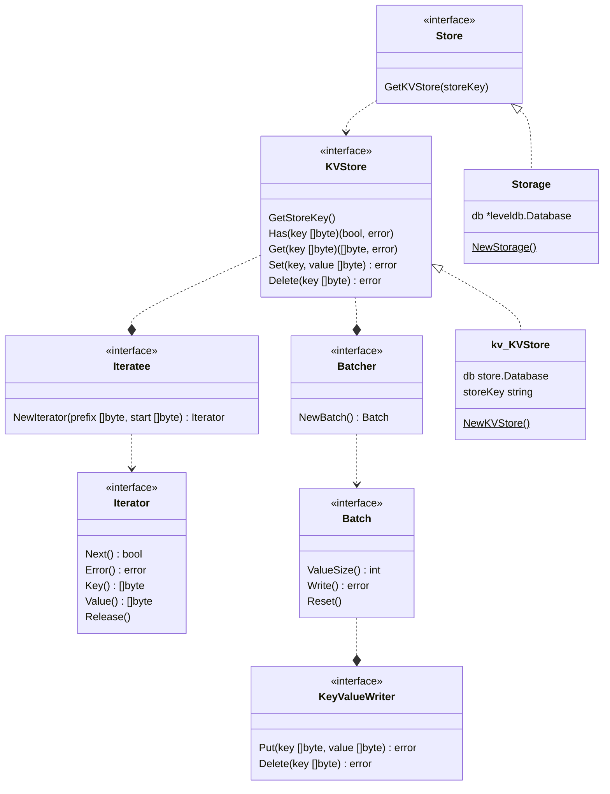
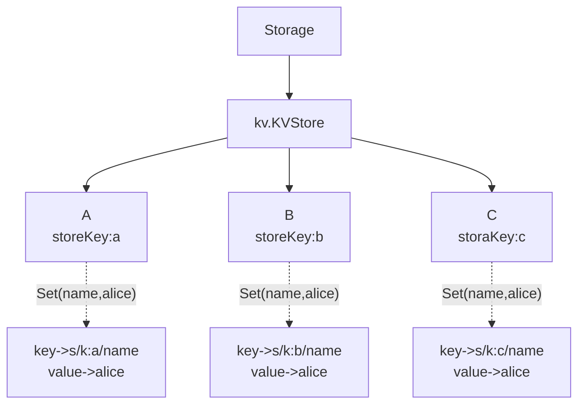

# 存储

存储部分，AppChain SDK 分为StateDB，Store两部分

## StateDB

StateDB 继承自 PlatON-Go，StateDB 保存链上状态，StateDB 在AppChain-SDK中，将其提供给应用开发者来向其写入新状态数据以及查询历史状态等

## Store

Store 是 AppChain-SDK 设计，目的是为各个模块提供存储服务，Store 存储不具有历史版本控制

Storage 利用LevelDB 实现了 Store 接口， 模块中使用 GetKVStore 进行创建 KVStore，可以kv.KVStore实现。
kv.KVStore 利用前缀key storeKey来进行存储。如图

A，B，C 使用相同的`name`作为键，`alice`作为值。在存储真实的键为 `s/k:a/name`、`s/k:b/name`、`s/k:c/name` 