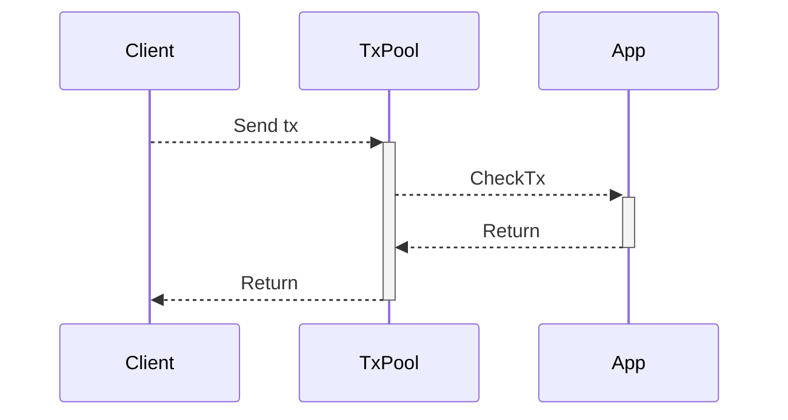
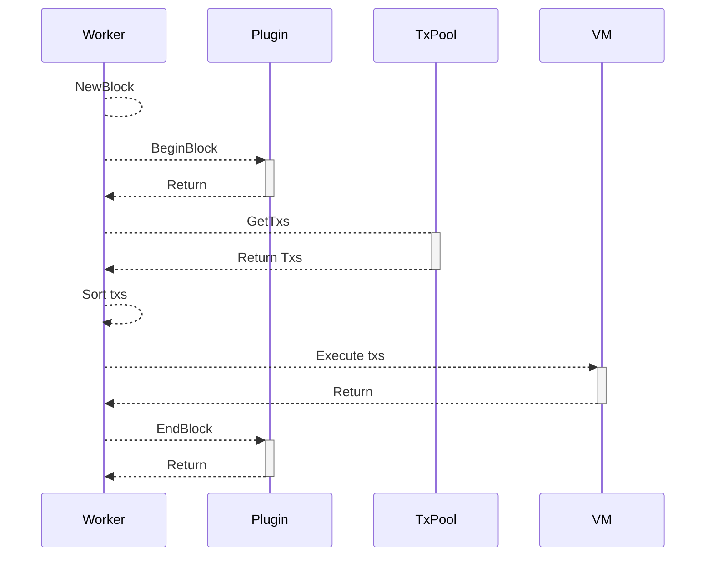
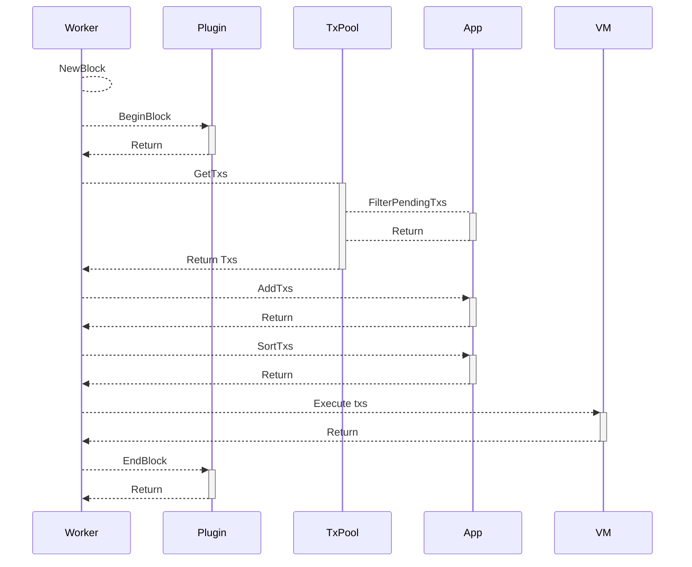

# 交易

## 交易类型

AppChain SDK 兼容 以太坊交易类型，支持EIP-155、EIP-1559

# 交易池检查

客户端发送交易，要先经过App检查才能进入交易池，通过 CheckTx 可以扩展多种类型检查，如白名单、黑名单等等

## 交易打包流程

为了满足开发者需求，AppChain SDK 改进区块交易打包流程，提供更多的扩展接口。

* PlatON 区块交易打包流程

* AppChain SDK 区块交易打包流程

Worker 向 TxPool 获取交易时，向 App通过FilterPendingTxs扩展接口对交易池中交易进行过滤
Worker 从 TxPool 获取交易后，仍能从 App的扩展接口 AddTxs 来获取交易，如在Bridge中一些L1->L2的同步的交易就是通过 AddTxs 加入到区块中
Worker 通过 App的SortTxs扩展接口对交易进行排序，如将某账号的交易优先执行等来获取利润
