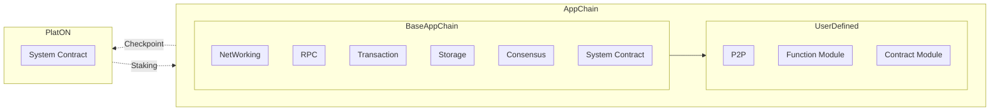

# AppChain 架构

上图描述应用链架构：

* AppChain 与 PlatON 主链直接通过合约方式进行消息传递。PlatON 主链负责 AppChain 的 Staking 等功能，AppChain 同时需要将 L2 状态 Checkpoint 向 PlatON 主链提交。
* AppChain 分为 BaseAppChain 与 UserDefined 两部分，BaseAppChain 包含链的基础部分
    * System Contract 系统合约，负责验证人，Staking，治理等功能
    * Consensus 模块，提供 Giskard BFT 共识模型
    * Storage 模块，存储链 Merkle 状态、区块、交易等
    * Transaction 交易执行，目前包括 VM 智能合约与 Go 用户自定义合约执行
    * RPC 模块，提供 RPC 访问，包括查询区块、交易，模拟交易
    * Networking 链的区块同步，共识消息传递等
* UserDefined 部分，包括
    * 合约模块，针对应用，利用 Solidity 接口规范，使用 Go 进行合约开发，SDK 提供将 Solidity 合约接口生成 Go 合约框架代码
    * 功能模块，利用 [应用开发接口]() 对链共识，区块执行等进行自定义开发
    * 开发者可以针对模块的功能自定义 RPC 接口
    * 开发者可以对模块增加自定义 P2P 协议