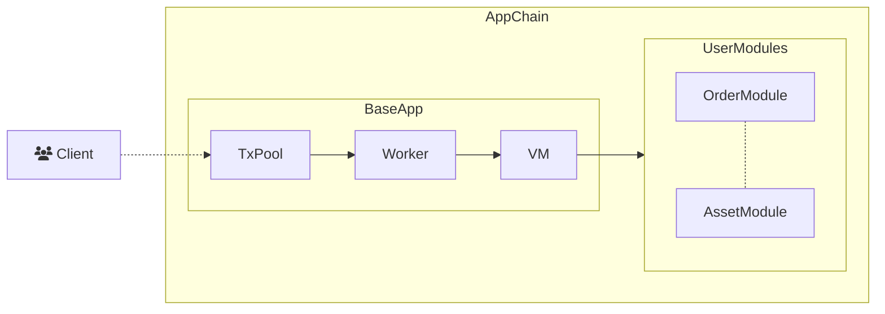
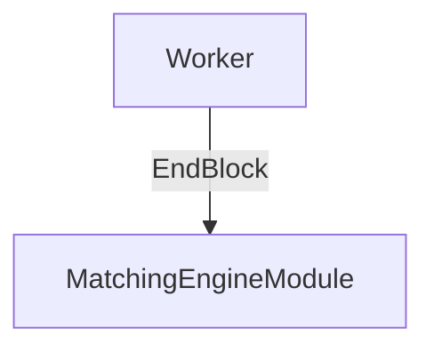

# 重要组件

AppChain-SDK 为应用链开发者提供便利，下面介绍下 AppChain-SDK 的重要组件。

## BaseApp

BaseApp 是应用链的基础实现，实现了应用链接口的基础处理，通过 BaseApp 可以迅速构建最基础的应用链，也可以基于 BaseApp 扩展应用链功能。

```go
type BaseApp struct {
    name    string
    version string
    chainID *big.Int
    
    store   store.Store
    manager *module.Manager
}
```
BaseApp store 为存储管理，manager 定义了模块间的各类关系，如创世顺序、启动初始化顺序、共识扩展调用顺序，自定义交易顺序，

## StateDB

在链功能开发中，往往需要链上存储状态数据，AppChain-SDK 通过 StateDB 进行状态存储，StateDB 采用 KV 形式， 并通过模块地址对各个模块数据进行隔离。

## 模块

模块 (Modules) 是 AppChain-SDK 重要组成部分。应用链开发者不仅可以通过 Solidity 合约进行开发，在一些需要高性能，复杂处理逻辑情况也可以通过模块的方式进行开发。模块分为合约模块与功能模块

合约模块，用 Go 来进行合约开发，下图是合约模块处理流程




用户发起合约模块交易进入到交易池 (TxPool)，矿工通过 Worker 模块将打包交易，通过 VM 进行执行，根据地址找到指定合约模块，发起调用

功能模块，通过应用开发接口来对基础链的功能进行扩展，如订单交易系统撮合，可以在区块交易全部执行结束，通过 EndBlock 接口对订单进行撮合。


