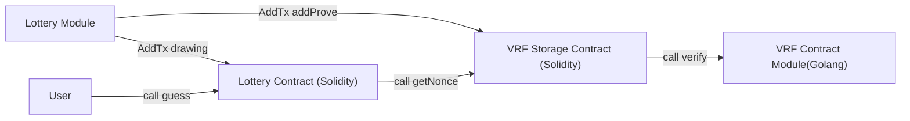

# 抽奖

抽奖用例使用VRF算法，为抽奖合约提供随机数数功能，涉及到的 AppChain-SDK 扩展功能有：
* GenesisModule
* TransactionModule
* Golang 内置合约
* Solidity 内置合约

## 构建

抽奖利用了Election 项目的POA选举，BLS 签名验证使用 Golang 合约模块的形式，VRF的生成是每个区块的提议节点生成，所以要验证 VRF 生成的结果正确 需要验证 VRF 的生产者是POA验证节点，并且该区块是由其提议；VRF 是基于前一个区块生成。

流程大致



* 定义合约地址

**VRF** `0x000000000000000000000000000000000000006F`
**VRFStorage** `0x00000000000000000000000000000000000000DE`
**Lottery** `0x000000000000000000000000000000000000014d`


* 创建 VRF 合约

```solidity
interface VRF {
    function verify(bytes calldata pubKey, bytes calldata pi, bytes calldata m) external view returns(bool);
    function hash(bytes calldata nonceProof) external view returns(bytes32);
}
```
生成 VRF 合约模块框架代码

```shell
make vrf
```


* 创建 VRFStorage 合约

```solidity
contract VRFStorage {
    mapping(uint256 => bytes) public nonceProofs;
    address public vrfAddr;
    event AddProve(uint256 blockNumber, address creator);
    constructor(address addr,bytes memory nonceProof){
        //设置创世 nonce及 VRF地址
        nonceProofs[0]= nonceProof;
        vrfAddr = addr;
    }
    function addProve(bytes calldata pubKey, bytes calldata nonceProof) external returns(bool){
        //验证证明长度
        require(nonceProof.length == 81, "VRFStorage: invalid proof length");
        //计算证明的创建地址
        address addr = address(uint160(uint256(keccak256(pubKey[1:]))));
        //区块的coinbase 是否是vrf的创建者
        require(addr == block.coinbase, "VRFStroage: invalid public key");
        //获取上一个区块的vrf nonce
        bytes memory previousNonce = nonceProofs[block.number-1];
        //调用vrf合约模块，验证vrf 证明
        bytes memory data = abi.encodeWithSignature("verify(bytes,bytes,bytes)", pubKey, nonceProof, previousNonce);
        data = Address.functionCall(address(0x000000000000000000000000000000000000006F), data, "VRFStroage: verify proof failed");
        bool result = abi.decode(data,(bool));
        require(result, "VRFStroage: verify proof failed");
        //保存证明
        nonceProofs[block.number] = nonceProof;
        emit AddProve(block.number, addr);
        return true;
    }

    function getNonce(uint256 blockNumber) external returns(bytes32){
        bytes memory nonceProof = nonceProofs[blockNumber];
        require(nonceProof.length != 0, "VRFStroage: invalid block number");
        bytes memory data = abi.encodeWithSignature("hash(bytes)", nonceProof);
        data = Address.functionCall(address(0x000000000000000000000000000000000000006F), data, "VRFStroage: decode proof failed");
        bytes32 nonce = abi.decode(data,(bytes32));
        return nonce;
    }
    function getNonceProof(uint256 blockNumber) external view returns(bytes memory){
        bytes memory nonceProof = nonceProofs[blockNumber];
        return nonceProof;
    }
}
```

生成 VRFStorage 框架代码

```shell
make vrfstorage
```

* 创建 Lottery 合约

```solidity

struct Participant{
    address owner;
    uint256 number;
}
contract Lottery  is ERC20 {
    using SafeMath for uint256;
    mapping(uint256 => Participant[]) _guess;
    VRFStorage _vrfStore;
    constructor(address vrfStore, string memory name, string memory symbol) ERC20(name, symbol){
        _vrfStore = VRFStorage(vrfStore);
    }

    event Guessing(address owner, uint256 number);
    event Drawing(address owner, uint256 number, uint256 nonce, uint256 bonus);

    //用户发起竞猜交易
    function guessing(uint256 number) external {
        Participant[] storage parts = _guess[block.number];
        parts.push(Participant({owner:msg.sender, number:number}));
        emit Guessing(msg.sender, number);
    }

    //Lottery 模块组装交易，开奖
    function drawing() external{
        //从 VRFStorage 合约获取 vrf nonce
        bytes32 nonce = _vrfStore.getNonce(block.number-1);
        //获取上一个区块的竞猜数据
        Participant[] storage parts = _guess[block.number-1];
        if (parts.length == 0) {return;}
        //找到与nonce值最小的竞猜者
        Participant storage lucky = parts[0];
        for (uint i = 1; i < parts.length; i++){
            if (_distance(parts[i].number, uint256(nonce)) < _distance(lucky.number, uint256(nonce))){
                lucky = parts[i];
            }
        }
        //进行奖励用户
        _mint(lucky.owner, 10000000);
        emit Drawing(lucky.owner, lucky.number, uint256(nonce), 10000000);
        delete _guess[block.number-1];
    }

    function _distance(uint256 a, uint256 b) internal pure returns(uint256){
        if (a > b){
            return a - b;
        }
        return b-a;
    }
}
```

* 实现 VRF 合约模块, 修改 vrf_impl.go


```go
func (c *VRF) Hash(nonceProof []byte) (common.Hash, error) {
	return common.BytesToHash(vrf.ProofToHash(nonceProof)), nil
}

func (c *VRF) Verify(pubKey []byte, pi []byte, m []byte) (bool, error) {
	pk, err := crypto.UnmarshalPubkey(pubKey)
	contracts.Require(err == nil, "VRF: invalid public key")
	ok, err := vrf.Verify(pk, pi, vrf.ProofToHash(m))
	contracts.Require(err == nil, "VRF: verify proof failed")
	if !ok {
		contracts.Require(ok, "VRF: verify proof failed")
	}
	return ok, nil
}

```

* 实现 Lottery 模块

```go
const ModuleVersion uint64 = 0
const ModuleName = "lottery"

var (
    //定义合约地址
	CallerAddress = common.BigToAddress(big.NewInt(103))

	VRFSystemAddr  = common.BigToAddress(big.NewInt(111))
	VRFStorageAddr = common.BigToAddress(big.NewInt(222))
	LotteryAddr    = common.BigToAddress(big.NewInt(333))
)


type Module struct {
}

func NewModule( *Module {
	return &Module{}
}

func (m *Module) Name() string {
	return ModuleName
}

func (m *Module) Version() uint64 {
	return ModuleVersion
}

```

* Lottery 创世初始化，实现 GenesisModule 接口

```go
//定义创世文件参数
type GenesisConfig struct {
    module.ModuleGenesisConfig
	Name   string `json:"name"`
	Symbol string `json:"symbol"`
	Nonce  string `json:"nonce"` //0x03f3b376f00863de14440eff826835d16ffa3c8b0fc7ad1402beee7ccf076aa9282f795c3e92d2f61e45e85abe5fcfef134ae6700a50b0885942a92d92b9c88a280450a416880be13a23e449f41ef12f43
}

func (m *Module) InitGenesis(ctx sdk.Context, db sdk.StateDB, chainConfig *params.ChainConfig, data json.RawMessage) error {
    //初始化VRF 合约模块
	vrf, _ := contracts.NewVRF(sdkcontracts.NewEVM(db, big.NewInt(0)), sdkcontracts.NewContract(m, m), false)
	vrf.InitGenesis(0)

	var genesis GenesisConfig
	if err := json.Unmarshal(data, &genesis); err != nil {
		return err
	}
    //部署 VRFStorage solidity 合约
	caller, err := contracts.NewVRFStorageGenesisCaller(ctx, db, chainConfig)
	if err != nil {
		return err
	}
	nonceProof := hexutil.MustDecode(genesis.Nonce)
	caller.WithCaller(CallerAddress).WithTo(VRFStorageAddr).DeployVRFStorage(nonceProof)
    //部署 Lottery solidity 合约
	lottery, err := contracts.NewLotteryGenesisCaller(ctx, db, chainConfig)
	if err != nil {
		return err
	}

	lottery.WithCaller(CallerAddress).WithTo(LotteryAddr).DeployLottery(VRFStorageAddr, genesis.Name, genesis.Symbol)

	return nil
}
```

* 实现 SDKContract 合约模块接口


```go
func (m *Module) Address() common.Address {
	return VRFSystemAddr
}

func (m *Module) Run(evm *vm.EVM, contract *vm.Contract, input []byte, readOnly bool) ([]byte, error) {
	vrfManager, _ := contracts.NewVRF(evm, contract, readOnly)
	return vrfManager.Run(input)
}

func (m *Module) ContractCreateBlockNumber(statedb sdk.StateDBReader) uint64 {
	vrf, _ := contracts.NewVRF(sdkcontracts.NewEVM(types.NewStateDBWrapper(statedb), big.NewInt(0)), sdkcontracts.NewContract(m, m), false)
	return vrf.GetCreateBlock()
}
```

* 实现 InitModule、TransactionModule 模块接口

TransactionModule 是向区块中添加交易，交易构建需要 私钥、chainId

实现 InitModule

```go
type Module struct {
	sync.Mutex
	chainConfig         *params.ChainConfig
	key                 *ecdsa.PrivateKey
	address             common.Address
	chainId             *big.Int
	lotteryTxBuilder    *contracts.LotteryTxBuilder
	vrfStorageTxBuilder *contracts.VRFStorageTxBuilder
}

//交易发送私钥
func NewModule(key *ecdsa.PrivateKey) *Module {
	return &Module{
		key:     key,
		address: crypto.PubkeyToAddress(key.PublicKey),
	}
}

func (m *Module) Init(ctx sdk.InitContext) error {
	m.chainConfig = ctx.Backend().ChainConfig()
	var err error
	m.chainId, err = ctx.Backend().ChainId()
	if err != nil {
		return err
	}
    //交易 builder
	m.lotteryTxBuilder, err = contracts.NewLotteryTxBuilder(LotteryAddr, m.key, m.chainId)
	if err != nil {
		return err
	}
	m.vrfStorageTxBuilder, err = contracts.NewVRFStorageTxBuilder(VRFStorageAddr, m.key, m.chainId)
	if err != nil {
		return err
	}
	return nil
}

func (m *Module) AddTxs(ctx sdk.WorkerContext, local map[common.Address]types.Transactions) (map[common.Address]types.Transactions, error) {
    // 获取发送者 nonce
	nonce := ctx.StateDB().GetNonce(m.address)
    // 生成 VRF 交易
	vrfTx, err := m.generateVRFProofTx(ctx, nonce)
	if err != nil {
		return nil, err
	}
    //生成 drawing 开奖交易
	drawTx, err := m.lotteryTxBuilder.WithNonce(nonce + 1).Drawing()
	if err != nil {
		return nil, err
	}

	return map[common.Address]types.Transactions{
		m.address: {vrfTx, drawTx},
	}, nil
}

func (m *Module) generateVRFProofTx(ctx sdk.WorkerContext, nonce uint64) (*types.Transaction, error) {
	blockNumber := ctx.Header().Number
	caller, err := contracts.NewVRFStorageGenesisCaller(ctx, ctx.StateDB(), m.chainConfig)
	if err != nil {
		return nil, err
	}
    //获取上一个区块 nonce proof
	previous, err := caller.WithCaller(CallerAddress).WithTo(VRFStorageAddr).GetNonceProof(new(big.Int).Sub(blockNumber, big.NewInt(1)))
	if err != nil {
		return nil, err
	}
    //生成 VRF 证明
	nonceProof, err := vrf.Prove(m.key, vrf.ProofToHash(previous))
	if err != nil {
		return nil, err
	}
    // 生成 addProve 交易
	tx, err := m.vrfStorageTxBuilder.WithNonce(nonce).AddProve(crypto.FromECDSAPub(&m.key.PublicKey), nonceProof)
	if err != nil {
		return nil, err
	}
	return tx, nil
}
```

## 测试程序


* Server

```go
func Server(ctx *cli.Context) error {
    //创建 Lottery 模块
	lotteryModule := lottery.NewModule(testutil.DefaultAccount[0].NodePrivateKey())
    //使用默认的选举选举模块
	vals, _ := testutil.NewValidator(testutil.DefaultAccount[0:1])
	vals.SetCoinbase(testutil.DefaultAccount[0].NodePrivateKey())
	manager := module.NewManager(vals, lotteryModule)
    //设置选举模块
	manager.SetElection(vals.Name())
    //设置创世初始化模块
	manager.SetOrderGenesis(lotteryModule.Name())
	app := testutil.NewApp(manager)
	config := lottery.GenesisConfig{
		Name:   "Token",
		Symbol: "USDC",
		Nonce:  "0x03f3b376f00863de14440eff826835d16ffa3c8b0fc7ad1402beee7ccf076aa9282f795c3e92d2f61e45e85abe5fcfef134ae6700a50b0885942a92d92b9c88a280450a416880be13a23e449f41ef12f43",
	}
	s, _ := json.Marshal(config)
	var stack []*node.Node
	var backend []*eth.Ethereum
	var err error
	if stack, backend, err = testutil.CreateCluster(testutil.DefaultAccount[0:1], testutil.DefaultAccount[0:1], []sdk.App{app}, map[string]json.RawMessage{
		lotteryModule.Name(): s,
	}, common2.UserAddrs); err != nil {
		return err
	}

	stack[0].Start()
	backend[0].Start()
	sigc := make(chan os.Signal, 1)
	signal.Notify(sigc, syscall.SIGINT, syscall.SIGTERM)
	<-sigc
	return nil
}

```


* Client

```go
func Client(ctx *cli.Context) error {

	cli, err := ethclient.Dial("http://127.0.0.1:8801")
	if err != nil {
		return err
	}
	lc, err := contracts.NewContract(lottery.LotteryAddr, cli)

	for i := 0; i < 10; i++ {
		err := sendTx(cli, lc)
		if err != nil {
			return err
		}
	}

	return nil
}

func sendTx(cli *ethclient.Client, lc *contracts.Contract) error {
    //获取测试账户的 nonce
	var nonces []uint64
	for _, addr := range common2.UserAddrs {
		nonce, err := cli.NonceAt(context.Background(), addr, nil)
		if err != nil {
			return err
		}
		nonces = append(nonces, nonce)
	}
    //发送竞猜交易
	var txs types.Transactions
	for i, addr := range common2.UserAddrs {
		tx, err := lc.Guessing(&bind.TransactOpts{
			From:  addr,
			Nonce: new(big.Int).SetUint64(nonces[i]),
			Signer: func(address common.Address, tx *types.Transaction) (*types.Transaction, error) {
				signer := types.NewLondonSigner(big.NewInt(123083))
				signature, err := crypto.Sign(signer.Hash(tx, nil).Bytes(), common2.UserPrivateKeys[addr])
				if err != nil {
					return nil, err
				}
				return tx.WithSignature(signer, signature)
			},
			Value:     nil,
			GasPrice:  big.NewInt(11000000000),
			GasFeeCap: nil,
			GasTipCap: nil,
			GasLimit:  0,
			Context:   nil,
			NoSend:    false,
		}, big.NewInt(int64(i)))
		if err != nil {
			return err
		}
		//fmt.Println("tx:", tx.Hash().String())
		txs = append(txs, tx)
	}
	time.Sleep(time.Second * 3)
	blocks := make(map[uint64]struct{})
	for _, tx := range txs {
		receipt, _ := cli.TransactionReceipt(context.Background(), tx.Hash())
		for _, log := range receipt.Logs {
			event, err := lc.ParseGuessing(*log)
			if err == nil {
				fmt.Println("block:", receipt.BlockNumber, "owner:", event.Owner.Hex(), "guess", event.Number)
				blocks[receipt.BlockNumber.Uint64()] = struct{}{}
			}
		}
	}
    //获取每个区块的获奖账户
	for blockNumber, _ := range blocks {
		block, err := cli.BlockByNumber(context.Background(), new(big.Int).SetUint64(blockNumber+1))
		if err != nil {
			panic(err)
		}
		for _, tx := range block.Transactions() {
			if *tx.To() == lottery.LotteryAddr {
				receipt, _ := cli.TransactionReceipt(context.Background(), tx.Hash())
				for _, log := range receipt.Logs {
					event, err := lc.ParseDrawing(*log)
					if err == nil {
						fmt.Println("drawing", "block:", receipt.BlockNumber,
							"address:", event.Owner.Hex(), "number:", event.Number, "nonce:", event.Nonce, "bonus", event.Bonus)
					}
				}
			}
		}
	}
	return nil
}
```

### 执行

* 编译

```shell
make lottery
```

* 启动 server

```shell
./lottery server
```

* 启动 client

```shell
./lottery client
```
输出
```
block: 21 owner: 0x8a0f3F8389F79a05Dd03027dE0Bcbb06cADB3F9c guess 0
block: 21 owner: 0x1FD13cA28ccc423e0565fD3C9b64187ad91Ae7D6 guess 1
block: 21 owner: 0x27E1a2e05186c9e4C4A3A957F8748fA35EA19076 guess 2
block: 21 owner: 0x6151aE08d3acD4c8194bB029633Ac7059066C75F guess 3
block: 21 owner: 0xE9565da74A5149e43475e62646dC4f47c2FcEa6f guess 4
block: 21 owner: 0xd1391ba0Be0eECA4031e952402b92e26417D5F38 guess 5
block: 21 owner: 0xEdA947963D73F7Ca96c94843E2bd091d31Ec9F90 guess 6
block: 21 owner: 0xD03ae6Da0708D073f3f920Ea1AAEbfdc847971b3 guess 7
block: 21 owner: 0xD9bE8f83736b508514183363a1fec4c0Bd1E80Db guess 8
block: 21 owner: 0x0504d04808022aC69bBb37206FD97Edaef9268e9 guess 9
drawing block: 22 address: 0x0504d04808022aC69bBb37206FD97Edaef9268e9 number: 9 nonce: 99893261135339502396020921976297378672327839790648820995938815664618377264179 bonus 10000000

```