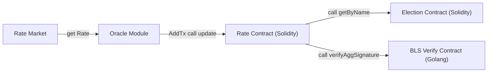

# 汇率预言机

汇率预言机用例主要展示如何使用共识扩展对链外信息进行共识，用例涉及到 AppChain-SDK 扩展功能有：
* GenesisModule
* TransactionModule
* ConsensusExtendModule
* Golang 内置合约
* Solidity 内置合约

## 构建


流程大致




* 定义合约地址

**Rate** `0x00000000000000000000000000000000000000CB`
**BlsVerify** `0x00000000000000000000000000000000000000CC`
**Election** `0x0000000000000000000000000000000000000065`

* BLS 签名验证合约

```solidity
interface BlsVerify{
    function verifyAggSignature(bytes32 message, bytes calldata signature, bytes[] calldata pubs) external returns(bool);
}
```

生成框架代码

```shell
make blsverify
```

* Rate 汇率合约

汇率合约实现需要进行 merkle 证明，及区块 BLS 签名验证，需要RLPEncode.sol、QC.sol、Merkle.sol 库文件

```solidity

contract Rate {
    using QC for QuorumCert;
    using Arrays for uint256[];
    using RLPEncode for bytes;
    using RLPEncode for bytes[];
    using RLPEncode for uint256;
    using Merkle for bytes32;
    uint256 public blockNumber;
    uint256 public rate;
    uint8 public decimals;
    event UpdateRate(uint256 blockNumber, uint256 rate);

    //设置汇率精度
    constructor(uint8 _decimals) {
        decimals = _decimals;
    }
    //汇率值，区块QC签名，签名 bitmap，签名，扩展数据merkle index，扩展数据merkle proof
    function update(uint256 newRate, QuorumCert memory qc, bytes calldata bitmap, bytes calldata signature, uint256 leafIndex, bytes32[] calldata proof) external{
        require(blockNumber < qc.blockNumber, "Rate: expired block qc");
        bytes memory data = newRate.encodeUint();
        bytes32 extendHash = keccak256(data);

        require(extendHash.checkMembership(leafIndex, qc.extendHash, proof), "Rate: invalid merkle proof");
        bytes32 qcHash = qc.hash();
        verifySignature(qc.blockNumber, qcHash, signature, bitmap);
        rate = newRate;
        blockNumber = qc.blockNumber;
        emit UpdateRate(blockNumber, rate);
    }

    function verifySignature(uint256 number, bytes32 message, bytes calldata signature, bytes calldata bitmap) private  {
        //根据bitmap ,blocknumber找到区块签名的公钥
        bytes[] memory pubs = findBlsKey(number, bitmap);
        //验证签名
        bytes memory data = abi.encodeWithSignature("verifyAggSignature(bytes32,bytes,bytes[])", message, signature, pubs);
        data = Address.functionCall(address(0x00000000000000000000000000000000000000cc), data, "Rate: verify proof failed");
        bool result = abi.decode(data,(bool));
        require(result, "Rate: verify proof failed");
    }

    function findBlsKey(uint256 number, bytes memory bitmap) private returns(bytes[] memory) {
        string[] memory nodes = findNodes(number);
        uint256 length = nodes.length;
        bytes[] memory pubs = new bytes[](length);
        for (uint256 i = 0; i < length;i++) {
            if (getValueFromBitmap(bitmap, i)) {
                bytes memory blsKey = getPubByName(nodes[i]);
                pubs[i] = blsKey;
            }
        }
        return pubs;
    }
    //调用 Election 合约获取验证人公钥
    function getPubByName(string memory name) private returns(bytes memory){
        bytes memory data = abi.encodeWithSignature("getByName(string)", name);
        data = Address.functionCall(address(0x0000000000000000000000000000000000000065), data, "Rate: get node failed");
        NodeInfo memory result = abi.decode(data, (NodeInfo));
        return result.blsPubKey;
    }


    function getLastRoundValidator() public returns(RoundNodeList memory) {
        bytes memory data = abi.encodeWithSignature("getLastRoundValidator()");
        data = Address.functionCall(address(0x0000000000000000000000000000000000000065), data, "Rate: get last round validator failed");
        RoundNodeList memory result = abi.decode(data, (RoundNodeList));
        return result;
    }

    function getCurrentRoundValidator() public returns(RoundNodeList memory) {
        bytes memory data = abi.encodeWithSignature("getCurrentRoundValidator()");
        data = Address.functionCall(address(0x0000000000000000000000000000000000000065), data, "Rate: get current round validator failed");
        RoundNodeList memory result = abi.decode(data, (RoundNodeList));
        return result;
    }

    function findNodes(uint256 number) public returns (string[] memory) {
        //获取上一轮验证人列表
        RoundNodeList memory list = getLastRoundValidator();
        //在范围返回节点列表
        if (list.start <=number && list.end>=number){
            return list.nodes;
        }
        //获取当前轮验证人列表
        list = getCurrentRoundValidator();
        if (list.start <=number && list.end>=number){
            return list.nodes;
        }
        string[] memory nodes;
        return nodes;
    }
    function getValueFromBitmap(bytes memory bitmap, uint256 index) private pure returns (bool) {
        uint256 byteNumber = index / 8;
        uint8 bitNumber = uint8(index % 8);

        if (byteNumber >= bitmap.length) {
            return false;
        }

        // Get the value of the bit at the given 'index' in a byte.
        return uint8(bitmap[byteNumber]) & (1 << bitNumber) > 0;
    }
}
```

编译
```shell
make rate
```

* 实现 blsverify 合约框架代码 blsverify_impl.go

```
func (c *BlsVerify) VerifyAggSignature(message common.Hash, signature []byte, pubs [][]byte) (bool, error) {
	var agg bls.PublicKey
	for _, pub := range pubs {
		var pk bls.PublicKey
		contracts.Require(pk.Deserialize(pub) == nil, "BlsVerify: decode public key failed")
		agg.Add(&pk)
	}
	var sign bls.Sign
	contracts.Require(sign.Deserialize(signature) == nil, "BlsVerify: decode signature failed")
	success := sign.Verify(&agg, string(message.Bytes()))
	return success, nil
}
```

* 模块构建

```go
const ModuleVersion uint64 = 0
const ModuleName = "oracle"

var (
	CallerAddress = common.BigToAddress(big.NewInt(201))
	RateAddr      = common.BigToAddress(big.NewInt(203))
	BlsVerifyAddr = common.BigToAddress(big.NewInt(204))
)
type Module struct {}
func NewModule(store store.Store, key *ecdsa.PrivateKey, rateClient RateMarketClient) *Module {
	return &Module{
	}
}

func (m *Module) Name() string {
	return ModuleName
}

func (m *Module) Version() uint64 {
	return ModuleVersion
}
```

* 实现 GenesisModule 接口，创世文件配置中 增加 decimals 定义汇率精度，BlockNumber 定义合约模块生效块高

```go
type GenesisConfig struct {
	module.ModuleGenesisConfig
	Decimals    uint8  `json:"decimals,omitempty"`
	BlockNumber uint64 `json:"blockNumber,omitempty"`
}

func (m *Module) InitGenesis(ctx sdk.Context, db sdk.StateDB, chainConfig *params.ChainConfig, data json.RawMessage) error {
	var genesis GenesisConfig
	if err := json.Unmarshal(data, &genesis); err != nil {
		return err
	}
	rateCaller, _ := contracts.NewRateGenesisCaller(ctx, db, chainConfig)
	err := rateCaller.WithCaller(CallerAddress).WithTo(RateAddr).DeployRate(genesis.Decimals)
	if err != nil {
		return err
	}
	evm := vm.NewEVM(vm.BlockContext{GasLimit: math.MaxUint64, BlockNumber: big.NewInt(0)}, vm.TxContext{}, db, chainConfig, vm.Config{}, nil)
	bls, _ := contracts.NewBlsVerify(evm, sdkcontracts.NewContract(m, m), false)

	bls.InitGenesis(genesis.BlockNumber)

	return nil
}
```

* 实现 ContractModule 接口

```go
func (m *Module) Address() common.Address {
	return BlsVerifyAddr
}

func (m *Module) Run(evm *vm.EVM, contract *vm.Contract, input []byte, readOnly bool) ([]byte, error) {
	verify, _ := contracts.NewBlsVerify(evm, contract, readOnly)
	return verify.Run(input)
}
func (m *Module) ContractCreateBlockNumber(statedb vm.StateDBReader) uint64 {
	c, _ := contracts.NewBlsVerify(sdkcontracts.NewEVM(types.NewStateDBWrapper(statedb), big.NewInt(0)), sdkcontracts.NewContract(m, m), false)
	return c.GetCreateBlock()
}
```

* 实现共识扩展，利用x/extravote 模块，实现其 extravote.ExtraVerifier 接口，同时实现 BlockCommitterModule 接口

实现 汇率本地存储，包含两部分，根据区块hash存储提议的汇率；存储最新的QC的汇率
```go
var (
	name  = "oracle"
	qcKey = []byte("qc")
)

type QCRateDB struct {
	db store.KVStore
}

func NewQCRateDB(store store.Store) *QCRateDB {
	return &QCRateDB{
		db: store.GetKVStore(name),
	}
}

func (q *QCRateDB) InsertRate(blockHash common.Hash, rate uint64) error {
	data, _ := rlp.EncodeToBytes(rate)
	return q.db.Set(blockHash.Bytes(), data)
}

func (q *QCRateDB) Rate(blockHash common.Hash) (uint64, error) {
	data, err := q.db.Get(blockHash.Bytes())
	if err != nil {
		return 0, err
	}
	var rate uint64
	err = rlp.DecodeBytes(data, &rate)
	if err != nil {
		return 0, err
	}
	return rate, nil
}

func (q *QCRateDB) InsertQCRate(blockHash common.Hash) error {
	_, err := q.Rate(blockHash)
	if err != nil {
		return err
	}
	return q.db.Set(qcKey, blockHash.Bytes())
}

func (q *QCRateDB) QCRate() (common.Hash, uint64, error) {
	data, err := q.db.Get(qcKey)
	if err != nil {
		return common.Hash{}, 0, err
	}
	if len(data) == 0 {
		return common.Hash{}, 0, errors.New("invalid qc data")
	}
	hash := common.BytesToHash(data)
	rate, err := q.Rate(hash)
	if err != nil {
		return common.Hash{}, 0, err
	}
	return hash, rate, nil
}
```


```go
//提议人获取汇率
func (m *Module) ExtendData(ctx sdk.ConsensusContext) []byte {
	rate, err := m.rateClient.Rate(USDCNY)
	if err != nil {
		return nil
	}
	data, _ := rlp.EncodeToBytes(rate)
	return data
}

//区块验证者验证汇率
func (m *Module) VerifyExtendData(ctx sdk.ConsensusContext, data []byte) error {
	if len(data) == 0 {
		return nil
	}
    //获取汇率
	expectRate, err := m.rateClient.Rate(USDCNY)
	if err != nil {
		return errors.New("request rate failed")
	}
    //解析扩展共识中的汇率数据
	var rate uint64
	rlp.DecodeBytes(data, &rate)
	if rate != expectRate {
		return errors.New(fmt.Sprintf("invalid rate, expect:%d, actual:%d", expectRate, rate))
	}
    //存储到本地
	return m.db.InsertRate(ctx.Header().Hash(), rate)
}

func (m *Module) PrepareQC(ctx sdk.ConsensusContext, block *protocols.PrepareBlock, votes map[uint32]*protocols.PrepareVote) {

}
func (m *Module) OnCommit(ctx sdk.ConsensusContext, block *types.Block) error {
    //存储达到QC 状态的汇率的 区块hash
	m.db.InsertQCRate(block.Hash())
	return nil
}
```

* 实现 TransactionModule 接口

```go
func (m *Module) AddTxs(ctx sdk.WorkerContext, local map[common.Address]types.Transactions) (map[common.Address]types.Transactions, error) {
    //获取交易发送者nonce
	nonce := ctx.StateDB().GetNonce(m.address)
    //本地获取QC状态的汇率
	blockHash, rate, err := m.db.QCRate()
	if err != nil {
		return nil, nil
	}
    //获取区块
	block := ctx.Backend().GetBlockByHash(blockHash)
	if block == nil {
		return nil, errors.New(fmt.Sprintf("get block failed:%s", blockHash.Hex()))
	}
    //解析共识QC签名
	_, qc, err := types2.DecodeExtra(block.ExtraData())
	if err != nil {
		return nil, err
	}
    //获取rate 扩展共识的merkle证明
	leaf, _ := rlp.EncodeToBytes(rate)
	index, proof, err := m.extraVoteDb.GetProof(qc.Epoch, qc.ViewNumber, qc.BlockIndex, leaf)
	if err != nil {
		return nil, err
	}
    //创建交易
	tx, err := m.rateTxBuilder.WithNonce(nonce).Update(big.NewInt(int64(rate)), contracts.QuorumCert{
		Epoch:       qc.Epoch,
		ViewNumber:  qc.ViewNumber,
		BlockHash:   qc.BlockHash,
		BlockNumber: qc.BlockNumber,
		BlockIndex:  qc.BlockIndex,
		ExtendHash:  qc.ExtendHash,
	}, qc.ValidatorSet.Bytes(), qc.Signature.Bytes(), big.NewInt(int64(index)), proof)
	return map[common.Address]types.Transactions{
		m.address: {tx},
	}, nil
}
```

## 测试程序构建


* Server

```go
func Server(ctx *cli.Context) error {
	store := memorydb.New()
    //构建模块，rate实现定时自增汇率
	oracleModule := oracle.NewModule(store, testutil.DefaultAccount[0].NodePrivateKey(), oracle.NewTimerRate(time.Second*2))
    //构建extravote模块，传入 oracle 模块
	extraVote := extravote.NewExtraVote(store, []extravote.ExtraVerifier{oracleModule})
    extraVote.AddEnableVerifiers(oracleModule.Name())
    //使用用例中的POA选举模块
	vals := election.NewModule()
	manager := module.NewManager(oracleModule, vals, extraVote)
	manager.SetElection(vals.Name())
	manager.SetOrderGenesis(vals.Name(), extraVote.Name(), oracleModule.Name())
	manager.SetConsensusExtend(extraVote.Name())
	app := testutil.NewApp(manager)

	config := election.GenesisConfig{
		InitialNodes: election.Nodes{
			election.Node{
				Name:        "node1",
				Owner:       testutil.DefaultAccount[0].NodeAddress(),
				Desc:        "node1",
				PublicKey:   crypto.FromECDSAPub(&testutil.DefaultAccount[0].NodePrivateKey().PublicKey),
				BlsPubKey:   testutil.DefaultAccount[0].BlsSecretKey().GetPublicKey().Serialize(),
				HostAddress: "127.0.0.1",
				RpcPort:     uint16(testutil.DefaultAccount[0].HTTP),
				P2pPort:     uint16(testutil.DefaultAccount[0].P2PPort),
			},
		},
		AdminAddress:     common2.UserAddrs[0],
		EpochSize:        250,
		ElectionDistance: 20,
	}
	s, _ := json.Marshal(config)
	og, _ := json.Marshal(oracle.GenesisConfig{Decimals: 3})
	var stack []*node.Node
	var backend []*eth.Ethereum
	var err error
	if stack, backend, err = testutil.CreateCluster(testutil.DefaultAccount[0:1], testutil.DefaultAccount[0:1], []sdk.App{app}, map[string]json.RawMessage{
		vals.Name():         s,
		oracleModule.Name(): og,
	}, common2.UserAddrs); err != nil {
		return err
	}

	stack[0].Start()
	backend[0].Start()
	sigc := make(chan os.Signal, 1)
	signal.Notify(sigc, syscall.SIGINT, syscall.SIGTERM)
	<-sigc
	return nil
}
```

* Client

定时调用合约查询汇率值
```go
func Client(ctx *cli.Context) error {

	cli, err := ethclient.Dial("http://127.0.0.1:8801")
	if err != nil {
		return err
	}
	lc, err := contracts.NewRate(oracle.RateAddr, cli)

	for i := 0; i < 10; i++ {
		blockNumber, err := lc.BlockNumber(nil)
		if err != nil {
			return err
		}
		rate, err := lc.Rate(nil)
		if err != nil {
			return err
		}
		fmt.Println("blockNumber:", blockNumber, "rate:", rate)
		time.Sleep(5 * time.Second)
	}

	return nil
}
```

* 编译
```shell
make oracle
```

* 启动 server

```shell
./oracle server
```


* 启动 client

```shell
./oracle client
```
